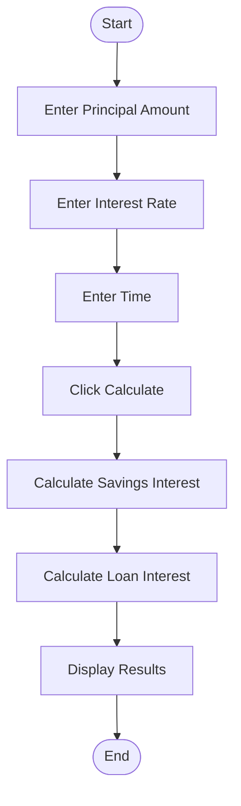
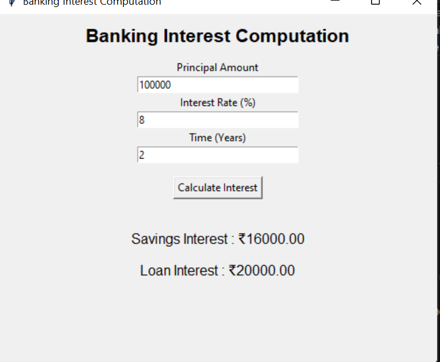

# Case Study 4: Banking Interest Computation Analysis

## 1. Problem Statement

Analyze banking interest calculation mechanisms and develop a Python solution for savings and loan computations.

---

## 2. Algorithm

1. Start the application.
2. Enter Principal Amount.
3. Enter Interest Rate.
4. Enter Time (Years).
5. Click **Calculate Interest**.
6. Calculate Savings Interest.
7. Calculate Loan Interest.
8. Display the results.
9. End the application.

---

## 3. Flowchart



---

## 4. Python Source Code

```python
import tkinter as tk
from tkinter import messagebox

def calculate():
    try:
        amount = float(amount_entry.get())
        rate = float(rate_entry.get())
        years = float(year_entry.get())

        savings_interest = (amount * rate * years) / 100
        loan_interest = (amount * (rate + 2) * years) / 100

        result.config(
            text=f"""
Savings Interest : ₹{savings_interest:.2f}

Loan Interest : ₹{loan_interest:.2f}
"""
        )

    except ValueError:
        messagebox.showerror("Error", "Enter valid values.")

root = tk.Tk()
root.title("Banking Interest Computation")
root.geometry("500x400")

tk.Label(root,
text="Banking Interest Computation",
font=("Arial",16,"bold")).pack(pady=10)

tk.Label(root,text="Principal Amount").pack()
amount_entry=tk.Entry(root,width=30)
amount_entry.pack()

tk.Label(root,text="Interest Rate (%)").pack()
rate_entry=tk.Entry(root,width=30)
rate_entry.pack()

tk.Label(root,text="Time (Years)").pack()
year_entry=tk.Entry(root,width=30)
year_entry.pack()

tk.Button(root,
text="Calculate Interest",
command=calculate).pack(pady=15)

result=tk.Label(root,text="")
result.pack()

root.mainloop()
```

---

## 5. Sample Input

```text
Principal Amount : 100000
Interest Rate    : 8
Time (Years)     : 2
```

## Sample Output

```text
Savings Interest : ₹16000.00

Loan Interest : ₹20000.00
```

### Calculation

```text
Savings Interest
= (100000 × 8 × 2) / 100
= ₹16000

Loan Interest
= (100000 × 10 × 2) / 100
= ₹20000
```
### screenshot
