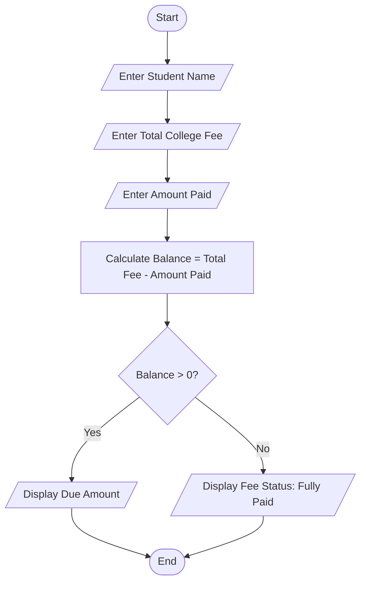
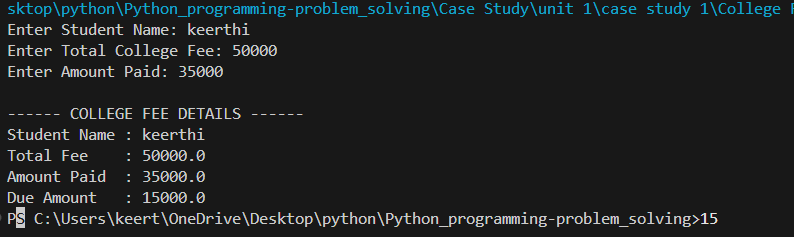

# Unit 1 Case Study: College Fee Management System

## 1. Problem Statement

Develop a Python program to manage college fee details. The program should accept the student's name, total college fee, and amount paid. It should calculate the remaining fee balance and display whether the fee is fully paid or if there is a due amount.

---

## 2. Objective

- To understand user input in Python.
- To perform arithmetic calculations.
- To use conditional statements (`if-else`).
- To generate a simple fee report.

---

## 3. Algorithm

1. Start.
2. Enter the student's name.
3. Enter the total college fee.
4. Enter the amount paid.
5. Calculate the balance amount.
6. If the balance is greater than zero, display the due amount.
7. Otherwise, display "Fee Status: Fully Paid".
8. Stop.

---

## 4. Flowchart



---

## 5. Python Source Code

```python
student_name = input("Enter Student Name: ")
total_fee = float(input("Enter Total College Fee: "))
amount_paid = float(input("Enter Amount Paid: "))

balance = total_fee - amount_paid

print("\n------ COLLEGE FEE DETAILS ------")
print("Student Name :", student_name)
print("Total Fee    :", total_fee)
print("Amount Paid  :", amount_paid)

if balance > 0:
    print("Due Amount   :", balance)
else:
    print("Fee Status   : Fully Paid")
```

---

## 6. Sample Input

```text
Enter Student Name: Keerthi
Enter Total College Fee: 50000
Enter Amount Paid: 35000
```

---

## 7. Sample Output

```text
------ COLLEGE FEE DETAILS ------
Student Name : Keerthi
Total Fee    : 50000.0
Amount Paid  : 35000.0
Due Amount   : 15000.0
```

---

## 8. Screenshot



## 9. Explanation

The program accepts the student's name, total college fee, and amount paid from the user. It calculates the remaining balance by subtracting the paid amount from the total fee. If there is any outstanding balance, it displays the due amount; otherwise, it displays that the fee has been fully paid.

---

## 10. Software Requirements

- Python 3.x
- Visual Studio Code
- GitHub