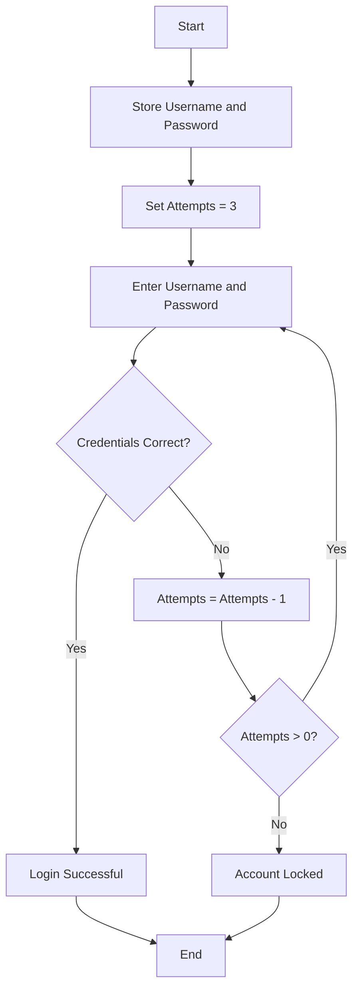
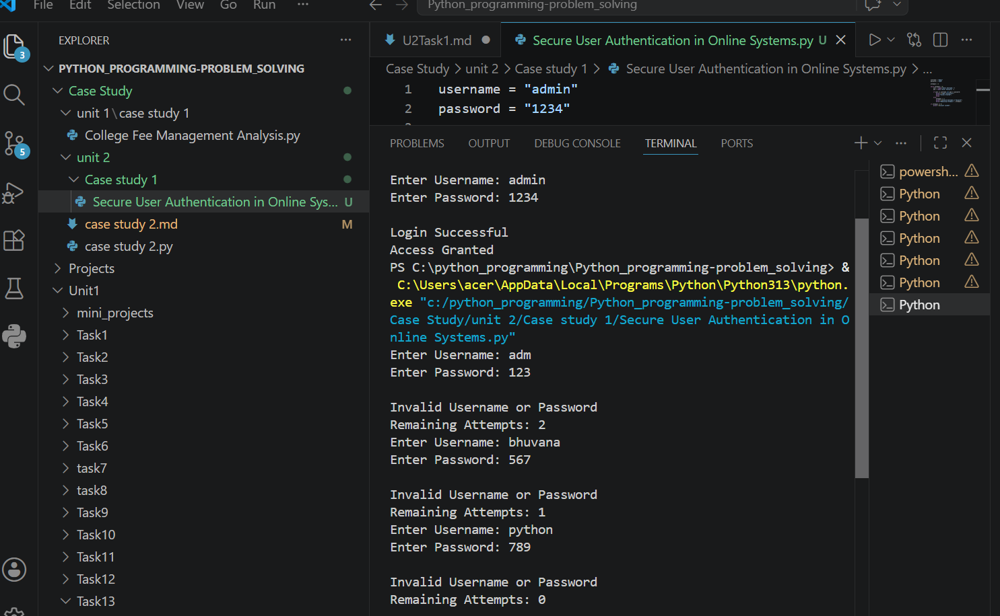

# Case Study 1: Secure User Authentication in Online Systems

## 1. Problem Statement

Develop a Python-based login authentication system that validates user credentials. The system should verify the username and password entered by the user, allow a maximum of three login attempts, and grant or deny access accordingly.

---

# 2. Algorithm

1. Start the program.
2. Store the valid username and password.
3. Set the number of login attempts to 3.
4. Prompt the user to enter the username and password.
5. Compare the entered credentials with the stored credentials.
6. If both are correct:

   * Display **"Login Successful"**.
   * Grant access.
   * End the program.
7. Otherwise:

   * Display **"Invalid Username or Password"**.
   * Decrease the remaining attempts.
8. Repeat Steps 4–7 until login is successful or attempts become zero.
9. If all attempts are exhausted, display **"Account Locked"**.
10. Stop the program.

---

# 3. Flowchart (README.md)





---

# 4. Python Source Code

```python
username = "admin"
password = "1234"

attempts = 3

while attempts > 0:
    user = input("Enter Username: ")
    pwd = input("Enter Password: ")

    if user == username and pwd == password:
        print("\nLogin Successful")
        print("Access Granted")
        break
    else:
        attempts -= 1
        print("\nInvalid Username or Password")
        print("Remaining Attempts:", attempts)

if attempts == 0:
    print("\nAccount Locked")
```

---

# 5. Sample Input / Output

### Sample Input 1

```text
Enter Username: admin
Enter Password: 1234
```

### Sample Output 1

```text
Login Successful
Access Granted
```

---

### Sample Input 2

```text
Enter Username: user
Enter Password: 1111

Enter Username: abc
Enter Password: 2222

Enter Username: guest
Enter Password: 3333
```

### Sample Output 2

```text
Invalid Username or Password
Remaining Attempts: 2

Invalid Username or Password
Remaining Attempts: 1

Invalid Username or Password
Remaining Attempts: 0

Account Locked
```

---

# 6. Screenshots

Take screenshots of the following program executions and upload them to GitHub:

