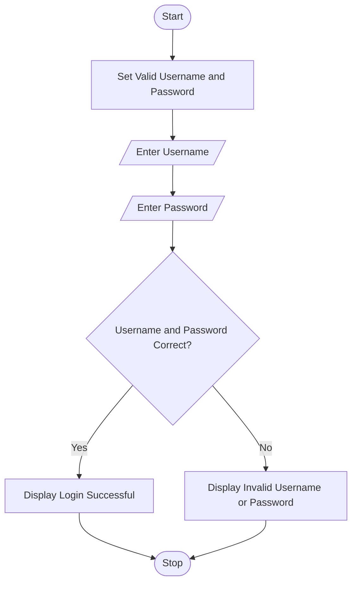

# Case Study 1: Secure User Authentication in Online Systems

## 1. Problem Statement

Analyze authentication requirements in online platforms and develop a Python-based login validation solution that verifies a user's username and password before granting access.

---

# 2. Algorithm

1. Start.
2. Set a valid username and password.
3. Input the username from the user.
4. Input the password from the user.
5. Compare the entered username and password with the valid credentials.
6. If both are correct:

   * Display **"Login Successful"**.
7. Otherwise:

   * Display **"Invalid Username or Password"**.
8. Stop.

---

# 3. Flowchart

````markdown

````

---

# 4. Python Source Code

```python
# Secure User Authentication

valid_username = "admin"
valid_password = "admin123"

username = input("Enter Username: ")
password = input("Enter Password: ")

if username == valid_username and password == valid_password:
    print("\nLogin Successful")
    print("Welcome,", username)
else:
    print("\nInvalid Username or Password")
```

---

# 5. Sample Input/Output

### Sample Input 1

```text
Enter Username: admin
Enter Password: admin123
```

### Sample Output 1

```text
Login Successful
Welcome, admin
```

---

### Sample Input 2

```text
Enter Username: bhuvana
Enter Password: 12345
```

### Sample Output 2

```text
Invalid Username or Password
```

This case study demonstrates a simple authentication system by validating the entered username and password against predefined credentials. It illustrates the use of conditional statements for secure login verification.
