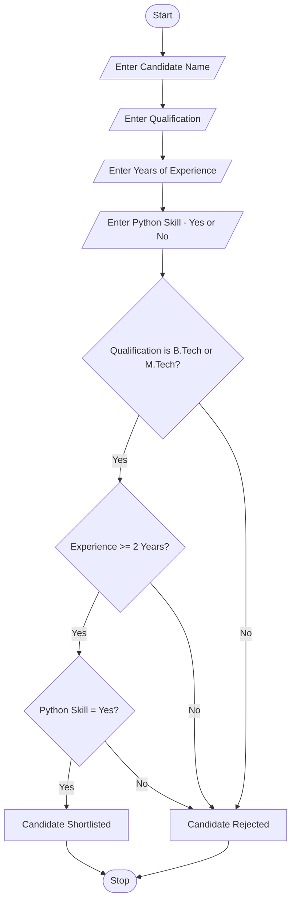
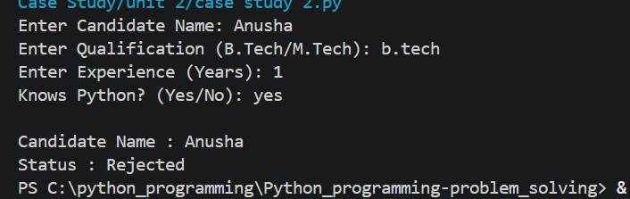
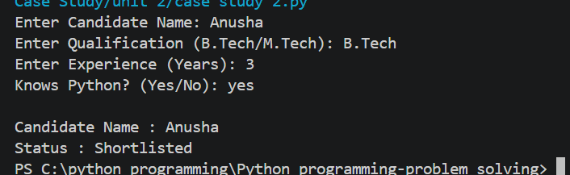

# Case Study 2: Recruitment Resume Screening

## 1. Problem Statement

Develop a Python application to analyze recruitment screening procedures and shortlist candidates based on predefined eligibility criteria such as qualification, work experience, and technical skills.

---

# 2. Algorithm

1. Start.
2. Input candidate name.
3. Input qualification.
4. Input years of experience.
5. Input whether the candidate has Python skill (Yes/No).
6. Check the eligibility:

   * Qualification must be **B.Tech** or **M.Tech**.
   * Experience must be **2 years or above**.
   * Python skill must be **Yes**.
7. If all conditions are satisfied:

   * Display **"Candidate Shortlisted"**.
8. Otherwise:

   * Display **"Candidate Rejected"**.
9. Stop.

---

# 3. Flowchart
# Recruitment Resume Screening Flowchart


# 4. Python Source Code

```python
name = input("Enter Candidate Name: ")
qualification = input("Enter Qualification (B.Tech/M.Tech): ")
experience = int(input("Enter Years of Experience: "))
python_skill = input("Do you know Python? (Yes/No): ")

if (qualification.lower() == "b.tech" or qualification.lower() == "m.tech") and experience >= 2 and python_skill.lower() == "yes":
    print("\nCandidate Name :", name)
    print("Status : Candidate Shortlisted")
else:
    print("\nCandidate Name :", name)
    print("Status : Candidate Rejected")
```

---

# 5. Sample Input/Output

### Sample Input

```text
Enter Candidate Name: Bhuvana
Enter Qualification (B.Tech/M.Tech): B.Tech
Enter Years of Experience: 3
Do you know Python? (Yes/No): Yes
```

### Sample Output

```text
Candidate Name : Bhuvana
Status : Candidate Shortlisted
```

---

### Another Sample

#### Input

```text
Enter Candidate Name: Rahul
Enter Qualification (B.Tech/M.Tech): B.Sc
Enter Years of Experience: 1
Do you know Python? (Yes/No): No
```

#### Output

```text
Candidate Name : Rahul
Status : Candidate Rejected
```
## 6 screenshort



