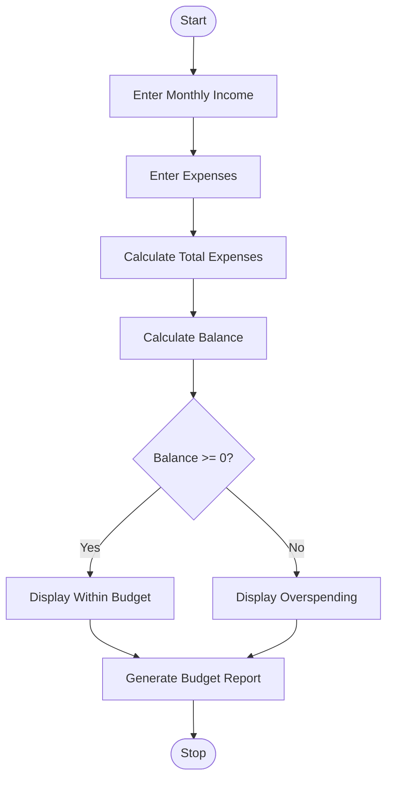
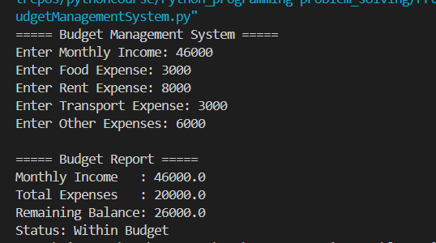
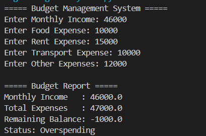

# Budget Management System Using Python

## 1. Problem Statement

Develop a Python application to plan, monitor, and analyze personal or household budgets.

The application should:

* Accept monthly income.
* Accept monthly expenses.
* Calculate total expenses.
* Determine the remaining balance.
* Analyze whether the user is within budget or overspending.
* Use Python fundamentals such as variables, input/output, arithmetic operations, functions, strings, and control structures.

---

## 2. Algorithm

1. Start the program.
2. Input monthly income.
3. Input expenses for different categories.
4. Calculate total expenses.
5. Calculate remaining balance.
   Balance = Income − Total Expenses
6. If balance is greater than or equal to 0:
   * Display "Within Budget".
7. Otherwise:
   * Display "Overspending".
8. Display budget report.
9. Stop the program.

---

## 3. Flowchart



---

## 4. Python Source Code

```python
# Budget Management System

def calculate_budget(income, expenses):
    total_expenses = sum(expenses)
    balance = income - total_expenses
    return total_expenses, balance

def display_report(income, expenses, total_expenses, balance):
    print("\n===== Budget Report =====")
    print("Monthly Income   :", income)
    print("Total Expenses   :", total_expenses)
    print("Remaining Balance:", balance)
    if balance >= 0:
        print("Status: Within Budget")
    else:
        print("Status: Overspending")

def main():
    print("===== Budget Management System =====")
    income = float(input("Enter Monthly Income: "))
    food = float(input("Enter Food Expense: "))
    rent = float(input("Enter Rent Expense: "))
    transport = float(input("Enter Transport Expense: "))
    other = float(input("Enter Other Expenses: "))
    expenses = [food, rent, transport, other]
    total_expenses, balance = calculate_budget(income, expenses)
    display_report(income, expenses, total_expenses, balance)
main()
```

---

## 5. Sample Input/Output

### Example 1

**Input**

```text
Enter Monthly Income: 50000
Enter Food Expense: 8000
Enter Rent Expense: 15000
Enter Transport Expense: 3000
Enter Other Expenses: 4000
```

**Output**

```text
===== Budget Report =====
Monthly Income   : 50000.0
Total Expenses   : 30000.0
Remaining Balance: 20000.0
Status           : Within Budget
```

---

### Example 2

**Input**

```text
Enter Monthly Income: 25000
Enter Food Expense: 7000
Enter Rent Expense: 15000
Enter Transport Expense: 4000
Enter Other Expenses: 3000
```

**Output**

```text
===== Budget Report =====
Monthly Income   : 25000.0
Total Expenses   : 29000.0
Remaining Balance: -4000.0
Status           : Overspending
```

---

## 6. Screenshots

### Screenshot 1: Budget Within Limit



### Screenshot 2: Overspending Case



