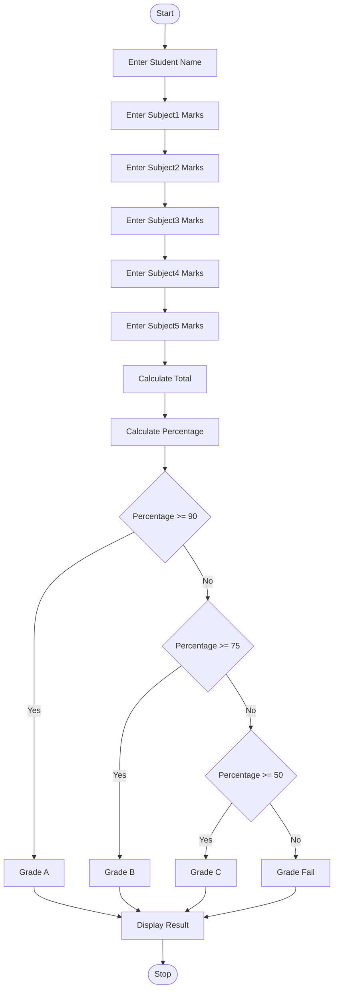
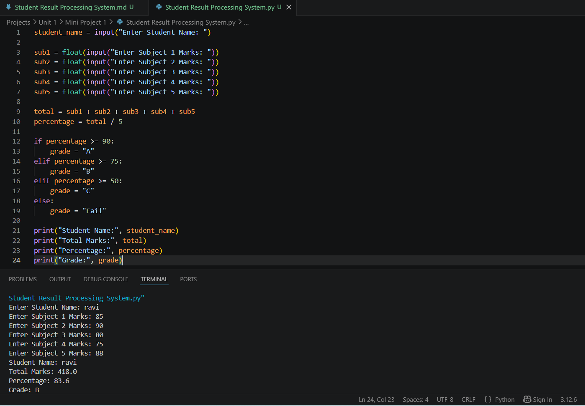

# Student Result Processing System

## 1. Problem Statement

Write a Python program to manage student marks, calculate percentage, assign grades, and generate academic performance reports.

The program accepts student name and marks of 5 subjects, calculates total marks, percentage, grade, and displays the result.

---

## 2. Algorithm

1. Start  
2. Enter student name  
3. Enter marks of 5 subjects  
4. Calculate total marks  
   Total = Subject1 + Subject2 + Subject3 + Subject4 + Subject5  
5. Calculate percentage  
   Percentage = Total / 5  
6. Check percentage:
   - If percentage >= 90, Grade = A  
   - Else if percentage >= 75, Grade = B  
   - Else if percentage >= 50, Grade = C  
   - Else Grade = Fail  
7. Display student name, total marks, percentage, and grade  
8. Stop  

---

## 3. Flowchart



---

## 4. Python Source Code

```python
student_name = input("Enter Student Name: ")

sub1 = float(input("Enter Subject 1 Marks: "))
sub2 = float(input("Enter Subject 2 Marks: "))
sub3 = float(input("Enter Subject 3 Marks: "))
sub4 = float(input("Enter Subject 4 Marks: "))
sub5 = float(input("Enter Subject 5 Marks: "))

total = sub1 + sub2 + sub3 + sub4 + sub5
percentage = total / 5

if percentage >= 90:
    grade = "A"
elif percentage >= 75:
    grade = "B"
elif percentage >= 50:
    grade = "C"
else:
    grade = "Fail"

print("Student Name:", student_name)
print("Total Marks:", total)
print("Percentage:", percentage)
print("Grade:", grade)
```

---

## 5. Sample Input / Output

### Sample 1

Input:

```text
Enter Student Name: Ravi
Enter Subject 1 Marks: 85
Enter Subject 2 Marks: 90
Enter Subject 3 Marks: 80
Enter Subject 4 Marks: 75
Enter Subject 5 Marks: 88
```

Output:

```text
Student Name: Ravi
Total Marks: 418.0
Percentage: 83.6
Grade: B
```

### Sample 2

Input:

```text
Enter Student Name: Priya
Enter Subject 1 Marks: 95
Enter Subject 2 Marks: 92
Enter Subject 3 Marks: 96
Enter Subject 4 Marks: 90
Enter Subject 5 Marks: 94
```

Output:

```text
Student Name: Priya
Total Marks: 467.0
Percentage: 93.4
Grade: A
```

---

## 6. Screenshots

---
