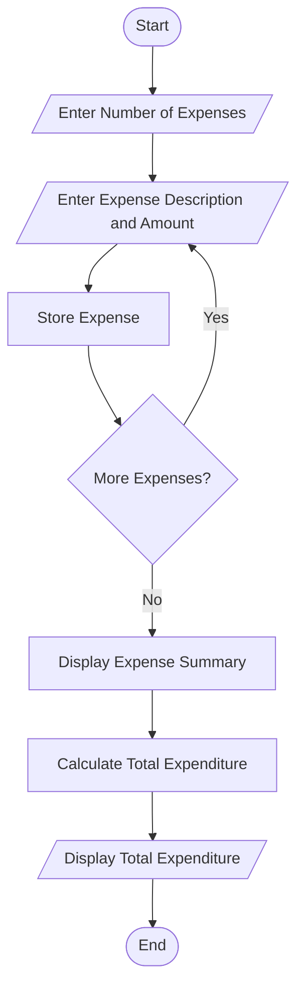
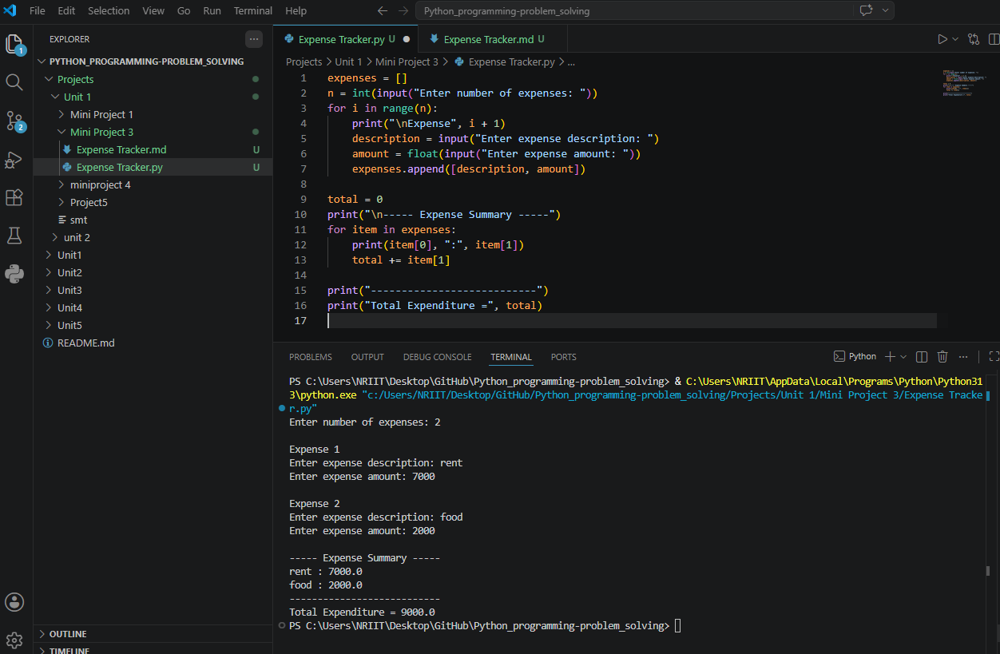

## Mini Project 3: Expense Tracker

## 1. Problem Statement

Develop a Python application that records daily expenses and generates 
expenditure summaries.

## 2. Algorithm

1. Start the program.
2. Create an empty list to store expenses.
3. Input the number of expenses.
4. Repeat for each expense:
5. Enter expense description.
6. Enter expense amount.
7. Store both in the list.
8. Initialize total expenditure to 0.
9. Display all recorded expenses.
10. Add each expense amount to the total.
11. Display total expenditure.
12. Stop the program.

## 3. Flowchart



## 4. Python Source Code

```
expenses = []

n = int(input("Enter number of expenses: "))

for i in range(n):
    print("\nExpense", i + 1)

    description = input("Enter expense description: ")
    amount = float(input("Enter expense amount: "))

    expenses.append([description, amount])

total = 0

print("\n----- Expense Summary -----")

for item in expenses:
    print(item[0], ":", item[1])
    total += item[1]

print("---------------------------")
print("Total Expenditure =", total)
```

## 5. Sample Input/Output

Sample Run 1
Enter number of expenses: 3

Expense 1
Enter expense description: Food
Enter expense amount: 250

Expense 2
Enter expense description: Travel
Enter expense amount: 150

Expense 3
Enter expense description: Internet
Enter expense amount: 500

----- Expense Summary -----
Food : 250.0
Travel : 150.0
Internet : 500.0
---------------------------
Total Expenditure = 900.0

6. Screenshots

