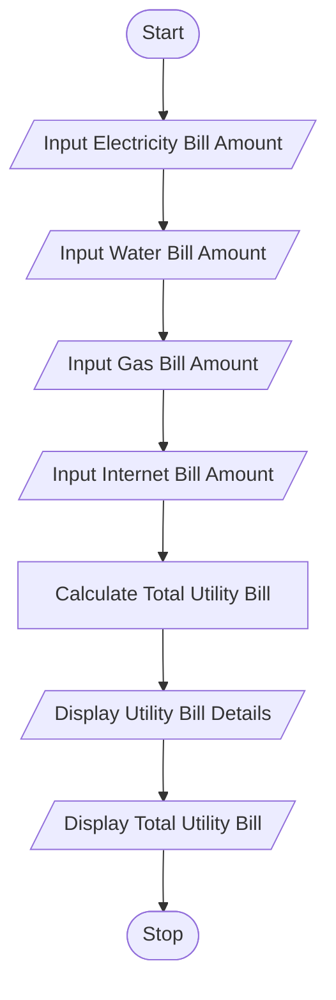
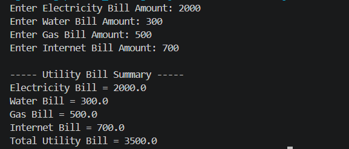

# Mini Project 5: Utility Bill Management System

## 1. Problem Statement

Develop a Python application to calculate and manage household utility bills. The system should accept electricity, water, gas, and internet bill amounts, calculate the total bill, and display a summary of all utility charges.

---

## 2. Algorithm

1. Start
2. Input Electricity Bill Amount
3. Input Water Bill Amount
4. Input Gas Bill Amount
5. Input Internet Bill Amount
6. Calculate Total Utility Bill
7. Display Electricity Bill
8. Display Water Bill
9. Display Gas Bill
10. Display Internet Bill
11. Display Total Utility Bill
12. Stop

---

## 3. Flowchart

### Mermaid Flowchart Code (.md)



---

## 4. Python Source Code

```python
electricity_bill = float(input("Enter Electricity Bill Amount: "))
water_bill = float(input("Enter Water Bill Amount: "))
gas_bill = float(input("Enter Gas Bill Amount: "))
internet_bill = float(input("Enter Internet Bill Amount: "))

total_bill = electricity_bill + water_bill + gas_bill + internet_bill

print("\n----- Utility Bill Summary -----")
print("Electricity Bill =", electricity_bill)
print("Water Bill =", water_bill)
print("Gas Bill =", gas_bill)
print("Internet Bill =", internet_bill)
print("Total Utility Bill =", total_bill)
```

---

## 5. Sample Input/Output

### Input

```text
Enter Electricity Bill Amount: 1200
Enter Water Bill Amount: 500
Enter Gas Bill Amount: 800
Enter Internet Bill Amount: 700
```

### Output

```text
----- Utility Bill Summary -----
Electricity Bill = 1200.0
Water Bill = 500.0
Gas Bill = 800.0
Internet Bill = 700.0
Total Utility Bill = 3200.0
```

### Screenshot
