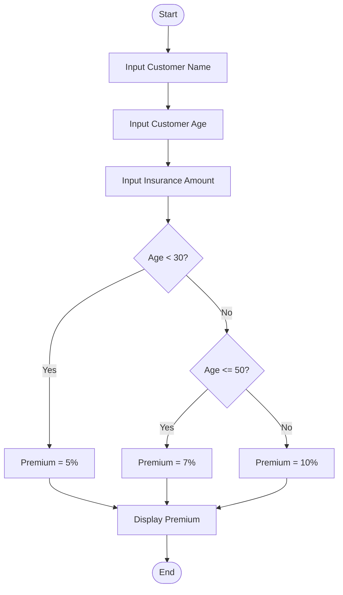
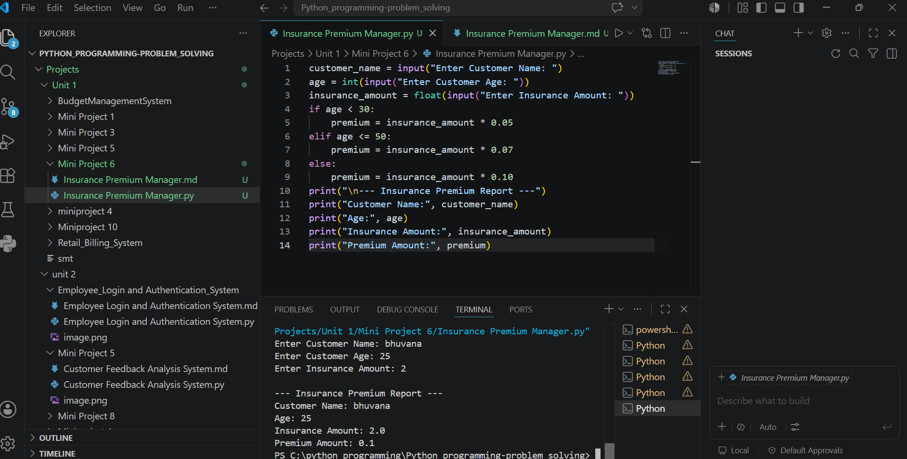

# Mini Project 6: Insurance Premium Manager

## Problem Statement

Develop a Python application to estimate and manage insurance premium calculations for customers.

---

## Algorithm

1. Start

2. Input customer name.

3. Input customer age.

4. Input insurance amount.

5. Calculate premium:

   * If age is less than 30, Premium = 5% of insurance amount.
   * If age is between 30 and 50, Premium = 7% of insurance amount.
   * If age is above 50, Premium = 10% of insurance amount.

6. Display customer details and premium amount.

7. Stop.

---

## Flowchart


## Flowchart




---

## Python Source Code

```python
customer_name = input("Enter Customer Name: ")
age = int(input("Enter Customer Age: "))
insurance_amount = float(input("Enter Insurance Amount: "))

if age < 30:
    premium = insurance_amount * 0.05
elif age <= 50:
    premium = insurance_amount * 0.07
else:
    premium = insurance_amount * 0.10

print("\n--- Insurance Premium Report ---")
print("Customer Name:", customer_name)
print("Age:", age)
print("Insurance Amount:", insurance_amount)
print("Premium Amount:", premium)
```

---

## Sample Input/Output

### Input

```text
Enter Customer Name: Bhuvana
Enter Customer Age: 35
Enter Insurance Amount: 500000
```

### Output

```text
--- Insurance Premium Report ---
Customer Name: Bhuvana
Age: 35
Insurance Amount: 500000.0
Premium Amount: 35000.0
```

---

## Screenshot

> Run the program and save the output screenshot as **`screenshot.png`** in the project folder.
