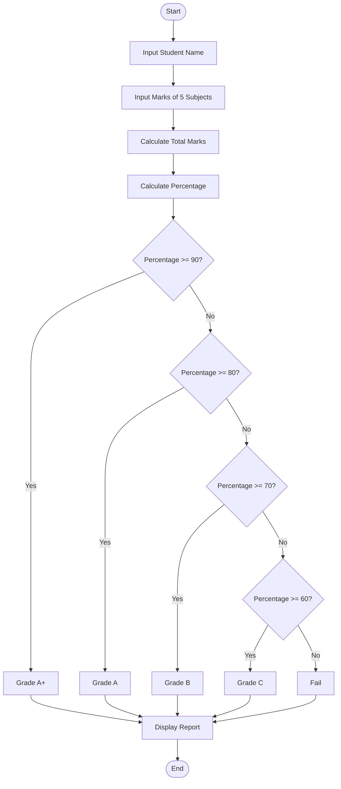
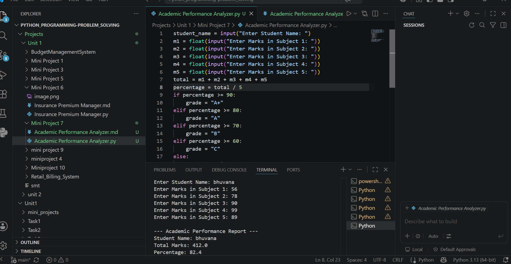

# Mini Project 7: Academic Performance Analyzer

## Problem Statement

Develop a Python application that analyzes student academic records and generates performance reports.

---

## Algorithm

1. Start

2. Input student name.

3. Input marks of five subjects.

4. Calculate total marks.

5. Calculate percentage.

6. Determine grade:

   * If percentage ≥ 90, Grade = A+
   * Else if percentage ≥ 80, Grade = A
   * Else if percentage ≥ 70, Grade = B
   * Else if percentage ≥ 60, Grade = C
   * Else, Grade = Fail

7. Display student details, total marks, percentage, and grade.

8. Stop.

---

## Flowchart



---

## Python Source Code

```python
student_name = input("Enter Student Name: ")

m1 = float(input("Enter Marks in Subject 1: "))
m2 = float(input("Enter Marks in Subject 2: "))
m3 = float(input("Enter Marks in Subject 3: "))
m4 = float(input("Enter Marks in Subject 4: "))
m5 = float(input("Enter Marks in Subject 5: "))

total = m1 + m2 + m3 + m4 + m5
percentage = total / 5

if percentage >= 90:
    grade = "A+"
elif percentage >= 80:
    grade = "A"
elif percentage >= 70:
    grade = "B"
elif percentage >= 60:
    grade = "C"
else:
    grade = "Fail"

print("\n--- Academic Performance Report ---")
print("Student Name:", student_name)
print("Total Marks:", total)
print("Percentage:", percentage)
print("Grade:", grade)
```

---

## Sample Input/Output

### Input

```text
Enter Student Name: Bhuvana
Enter Marks in Subject 1: 95
Enter Marks in Subject 2: 90
Enter Marks in Subject 3: 88
Enter Marks in Subject 4: 92
Enter Marks in Subject 5: 85
```

### Output

```text
--- Academic Performance Report ---
Student Name: Bhuvana
Total Marks: 450.0
Percentage: 90.0
Grade: A+
```

---

## Screenshot

> Run the program and save the output screenshot as **`screenshot.png`** in the project folder.
