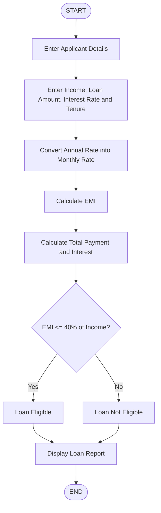

## Loan Processing Calculator

## 1. Problem Statement

Develop a Python application to calculate EMI (Equated Monthly Installment), generate loan repayment schedules, and check loan eligibility. 

## 2. Algorithm

1. Start the program.

2. Enter applicant details:

Applicant name
Monthly income
Loan amount
Annual interest rate
Loan tenure in years

3. Convert annual interest rate into monthly interest rate.

4. Calculate the total number of monthly installments.

5. Calculate EMI using the formula:

EMI=P×R×(1+R)N​/(1+R)N-1
Where:

P = Principal loan amount
R = Monthly interest rate
N = Number of months

6. Calculate total repayment amount.

7. Calculate total interest payable.

8. Check loan eligibility:

If EMI ≤ 40% of monthly income → Loan Eligible.
Otherwise → Loan Not Eligible.

9. Display loan details and repayment schedule.

10. Stop the program.

## 3. Flowchart

                 
## 4. Source Code (Python)

print("----- Loan Processing Calculator -----")

name = input("Enter Applicant Name: ")

income = float(input("Enter Monthly Income: "))

loan_amount = float(input("Enter Loan Amount: "))

rate = float(input("Enter Annual Interest Rate (%): "))

years = int(input("Enter Loan Tenure (Years): "))

# EMI Calculation

monthly_rate = rate / (12 * 100)

months = years * 12

emi = (loan_amount * monthly_rate * 
       (1 + monthly_rate) ** months) / \
      ((1 + monthly_rate) ** months - 1)

total_payment = emi * months

total_interest = total_payment - loan_amount

# Loan Eligibility Check

if emi <= income * 0.40:
    status = "Loan Approved - Eligible"
else:
    status = "Loan Rejected - Not Eligible"

# Display Results

print("\n----- Loan Details -----")

print("Applicant Name:", name)

print("Loan Amount: ₹", loan_amount)

print("Loan Tenure:", years, "Years")

print("Monthly EMI: ₹", round(emi, 2))

print("Total Payment: ₹", round(total_payment, 2))

print("Total Interest: ₹", round(total_interest, 2))

print("Loan Status:", status)

# Repayment Schedule

print("\n----- Repayment Schedule -----")

balance = loan_amount

for month in range(1, months + 1):

    interest = balance * monthly_rate

    principal = emi - interest

    balance = balance - principal

    print("Month", month,
          "Remaining Balance: ₹",
          round(max(balance, 0), 2))

## 5. Sample Input

Enter Applicant Name: Rahul

Enter Monthly Income: 50000

Enter Loan Amount: 500000

Enter Annual Interest Rate (%): 8

Enter Loan Tenure (Years): 5

## 6. Sample Output

Applicant Name: Rahul

Loan Amount: ₹500000

Loan Tenure: 5 Years

Monthly EMI: ₹10138.71

Total Payment: ₹608322.60

Total Interest: ₹108322.60

Loan Status: Loan Approved - Eligible

Repayment Schedule

Month 1 Remaining Balance: ₹492769.90

Month 2 Remaining Balance: ₹485491.60

Month 3 Remaining Balance: ₹478164.60

Month 4 Remaining Balance: ₹470787.00

## 7. Screenshot
