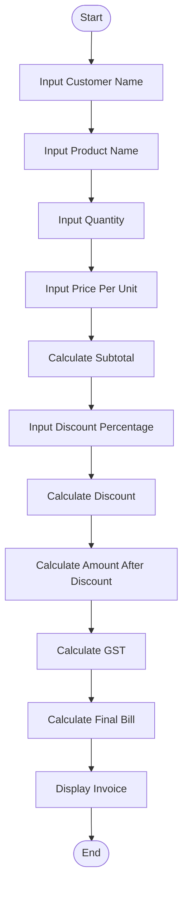
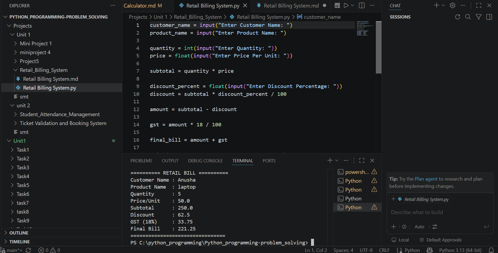

# Mini Project 4: Retail Billing System

## Problem Statement

Develop a Python-based billing system that generates invoices, applies discounts, and calculates taxes.

## Algorithm

1. Start

2. Input customer name.

3. Input product name.

4. Input quantity.

5. Input price per unit.

6. Calculate subtotal.

   **Subtotal = Quantity × Price per Unit**

7. Input discount percentage.

8. Calculate discount amount.

   **Discount = (Subtotal × Discount Percentage) / 100**

9. Calculate amount after discount.

   **Amount = Subtotal − Discount**

10. Calculate GST (18%).

    **GST = Amount × 18 / 100**

11. Calculate final bill.

    **Final Bill = Amount + GST**

12. Display invoice with all bill details.

13. Stop.

## Flowchart

## Flowchart

## Python Source Code

customer_name = input("Enter Customer Name: ")
product_name = input("Enter Product Name: ")

quantity = int(input("Enter Quantity: "))
price = float(input("Enter Price Per Unit: "))

subtotal = quantity * price

discount_percent = float(input("Enter Discount Percentage: "))
discount = subtotal * discount_percent / 100

amount = subtotal - discount

gst = amount * 18 / 100

final_bill = amount + gst

print("\n========== RETAIL BILL ==========")
print("Customer Name :", customer_name)
print("Product Name  :", product_name)
print("Quantity      :", quantity)
print("Price/Unit    :", price)
print("Subtotal      :", subtotal)
print("Discount      :", discount)
print("GST (18%)     :", gst)
print("Final Bill    :", final_bill)
print("================================")

## Sample Input/Output

### Input

Enter Customer Name: Anusha
Enter Product Name: Laptop Bag
Enter Quantity: 2
Enter Price Per Unit: 1500
Enter Discount Percentage: 10

### Output

========== RETAIL BILL ==========
Customer Name : Anusha
Product Name  : Laptop Bag
Quantity      : 2
Price/Unit    : 1500.0
Subtotal      : 3000.0
Discount      : 300.0
GST (18%)     : 486.0
Final Bill    : 3186.0

## Screenshot

> 
