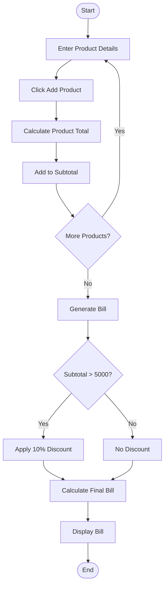
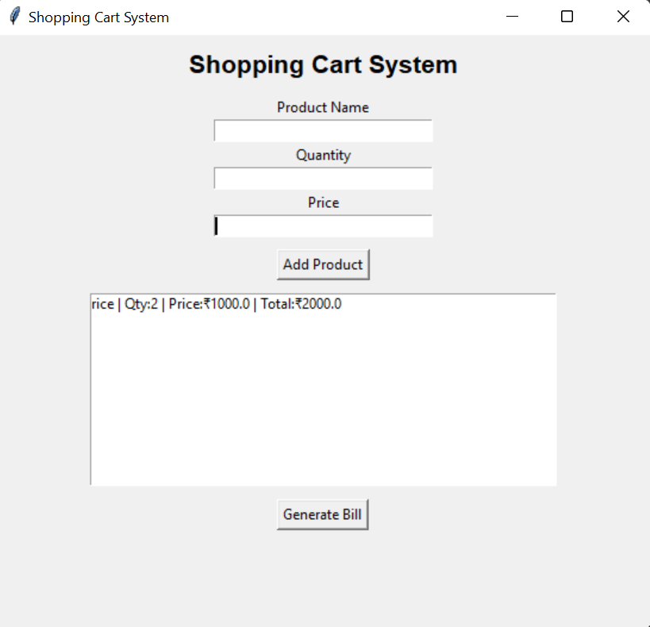

# Mini Project 9: Shopping Cart System

## 1. Problem Statement

Develop a Python application that manages products, quantities, discounts, and final billing using a graphical user interface (GUI).

---

## 2. Algorithm

1. Start the application.
2. Enter Product Name.
3. Enter Quantity.
4. Enter Price.
5. Click **Add Product**.
6. Calculate Product Total.
7. Add Product Total to Subtotal.
8. Repeat for all products.
9. Click **Generate Bill**.
10. Apply a 10% discount if Subtotal > ₹5000.
11. Calculate the Final Bill.
12. Display the billing details.
13. End the application.

---

## 3. Flowchart



---

## 4. Python Source Code

```python
# Save as shopping_cart_system.py
# (Copy the code from shopping_cart_system.py)
```

---

## 5. Sample Input

```text
Product Name : Rice
Quantity     : 2
Price        : 1000

Product Name : Oil
Quantity     : 3
Price        : 1200
```

## Sample Output

```text
Subtotal : ₹5600.00
Discount : ₹560.00
Final Bill : ₹5040.00
```
### screenshot

