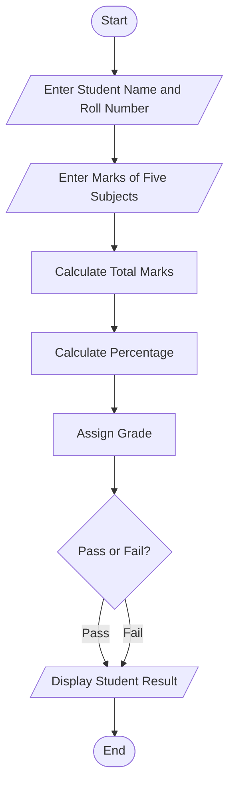
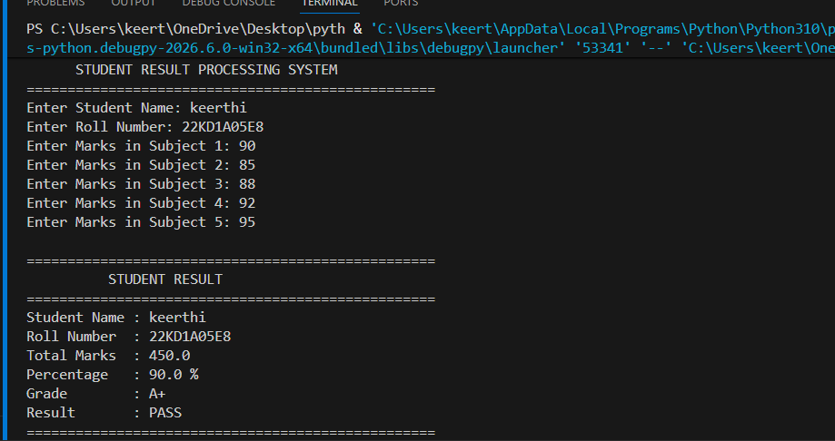

# Mini Project 1: Student Result Processing System

## 1. Problem Statement

Develop a Python application to manage student marks, calculate percentage, assign grades, and generate academic performance reports.

---

## 2. Objective

To develop a Python application that accepts student details and marks, calculates the total marks and percentage, assigns grades based on the percentage, and displays the student's academic result.

---

## 3. Algorithm

1. Start
2. Input student name and roll number.
3. Input marks for five subjects.
4. Calculate total marks.
5. Calculate percentage.
6. Assign grade based on percentage.
7. Determine Pass or Fail.
8. Display student details, total, percentage, grade, and result.
9. Stop.

---

## 4. Flowchart



---

## 5. Python Source Code

```python
print("=" * 50)
print("      STUDENT RESULT PROCESSING SYSTEM")
print("=" * 50)

name = input("Enter Student Name: ")
roll_no = input("Enter Roll Number: ")

m1 = float(input("Enter Marks in Subject 1: "))
m2 = float(input("Enter Marks in Subject 2: "))
m3 = float(input("Enter Marks in Subject 3: "))
m4 = float(input("Enter Marks in Subject 4: "))
m5 = float(input("Enter Marks in Subject 5: "))

total = m1 + m2 + m3 + m4 + m5
percentage = total / 5

if percentage >= 90:
    grade = "A+"
elif percentage >= 80:
    grade = "A"
elif percentage >= 70:
    grade = "B"
elif percentage >= 60:
    grade = "C"
elif percentage >= 50:
    grade = "D"
else:
    grade = "F"

print("\n" + "=" * 50)
print("          STUDENT RESULT")
print("=" * 50)
print("Student Name :", name)
print("Roll Number  :", roll_no)
print("Total Marks  :", total)
print("Percentage   :", round(percentage, 2), "%")
print("Grade        :", grade)

if grade == "F":
    print("Result       : FAIL")
else:
    print("Result       : PASS")

print("=" * 50)
```

---

## 6. Sample Input

```text
Enter Student Name: Keerthi
Enter Roll Number: 22KD1A05E8

Enter Marks in Subject 1: 90
Enter Marks in Subject 2: 85
Enter Marks in Subject 3: 88
Enter Marks in Subject 4: 92
Enter Marks in Subject 5: 95
```

---

## 7. Sample Output

```text
Student Name : Keerthi
Roll Number  : 22KD1A05E8
Total Marks  : 450.0
Percentage   : 90.0 %
Grade        : A+
Result       : PASS
```

---

## 8. Screenshot



---

## 9. Explanation

The program accepts the student's personal details and marks in five subjects. It calculates the total marks and percentage, assigns a grade based on the percentage, determines whether the student has passed or failed, and displays the complete academic report.

---

## 10. Software Requirements

- Python 3.x
- Visual Studio Code
- GitHub