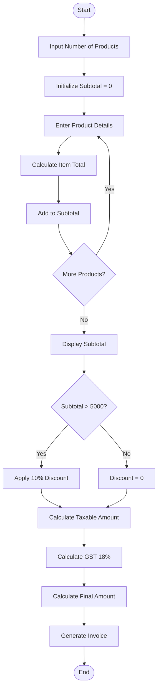

# Mini Project 4: Retail Billing System

## Problem Statement
Develop a Python-based billing system that generates invoices, applies discounts, and calculates taxes.

## Algorithm

1. Start the program.
2. Input the number of products.
3. Initialize subtotal to 0.
4. Enter product details (name, quantity, price).
5. Calculate item total and add to subtotal.
6. Repeat until all products are entered.
7. Apply 10% discount if subtotal exceeds ₹5000.
8. Calculate GST at 18%.
9. Calculate final amount.
10. Display invoice.
11. End the program.

## Flowchart



## Sample Input

```text
Enter number of products: 2

Product 1
Enter product name: Laptop Bag
Enter quantity: 2
Enter price per unit: 1500

Product 2
Enter product name: Mouse
Enter quantity: 3
Enter price per unit: 800
```

## Sample Output

```text
========== INVOICE ==========

Product         Qty        Price      Total
Laptop Bag      2          1500.0     3000.0
Mouse           3          800.0      2400.0

Subtotal      : ₹ 5400.0
Discount      : ₹ 540.0
GST (18%)     : ₹ 874.8
Final Amount  : ₹ 5734.8
=============================
```

### screenshot
