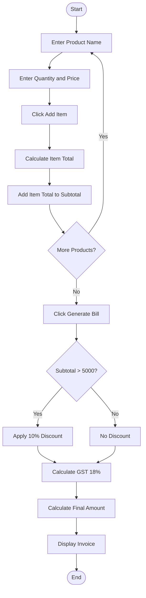
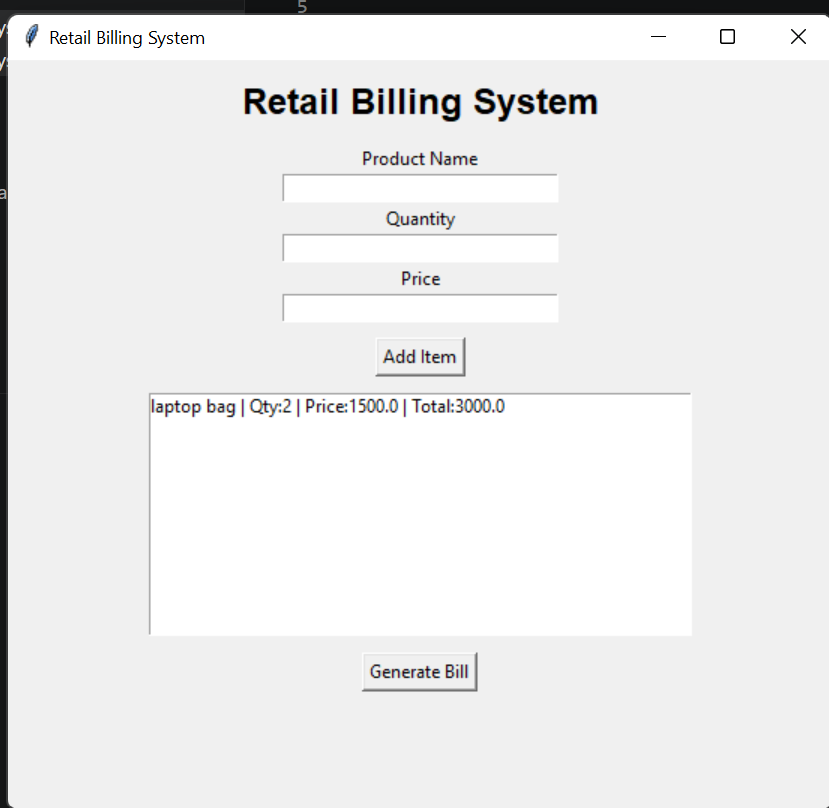

# Mini Project 4: Retail Billing System

## 1. Problem Statement

Develop a Python-based billing system that generates invoices, applies discounts, and calculates taxes. The system provides a graphical user interface (GUI) to enter product details, generate bills, apply discounts, calculate GST, and display the final payable amount.

---

## 2. Algorithm

1. Start the application.
2. Enter Product Name, Quantity, and Price.
3. Click **Add Item**.
4. Calculate Item Total = Quantity × Price.
5. Add Item Total to Subtotal.
6. Repeat the process for all products.
7. Click **Generate Bill**.
8. If Subtotal > ₹5000, apply a 10% discount.
9. Calculate GST (18%) on the discounted amount.
10. Calculate Final Amount.
11. Display Subtotal, Discount, GST, and Final Amount.
12. End the application.

---

## 3. Flowchart



---

## 4. Python Source Code

```python
import tkinter as tk
from tkinter import messagebox

subtotal = 0

def add_item():
    global subtotal

    try:
        name = product_entry.get()
        qty = int(qty_entry.get())
        price = float(price_entry.get())

        total = qty * price
        subtotal += total

        item_list.insert(
            tk.END,
            f"{name} | Qty:{qty} | Price:{price} | Total:{total}"
        )

        product_entry.delete(0, tk.END)
        qty_entry.delete(0, tk.END)
        price_entry.delete(0, tk.END)

    except ValueError:
        messagebox.showerror("Error", "Enter valid values")

def generate_bill():
    discount = subtotal * 0.10 if subtotal > 5000 else 0

    gst = (subtotal - discount) * 0.18
    final_amount = subtotal - discount + gst

    result_label.config(
        text=f"""
Subtotal : ₹{subtotal:.2f}
Discount : ₹{discount:.2f}
GST (18%) : ₹{gst:.2f}
Final Amount : ₹{final_amount:.2f}
"""
    )

root = tk.Tk()
root.title("Retail Billing System")
root.geometry("550x500")

tk.Label(
    root,
    text="Retail Billing System",
    font=("Arial", 18, "bold")
).pack(pady=10)

tk.Label(root, text="Product Name").pack()
product_entry = tk.Entry(root)
product_entry.pack()

tk.Label(root, text="Quantity").pack()
qty_entry = tk.Entry(root)
qty_entry.pack()

tk.Label(root, text="Price").pack()
price_entry = tk.Entry(root)
price_entry.pack()

tk.Button(
    root,
    text="Add Item",
    command=add_item
).pack(pady=10)

item_list = tk.Listbox(root, width=60)
item_list.pack()

tk.Button(
    root,
    text="Generate Bill",
    command=generate_bill
).pack(pady=10)

result_label = tk.Label(root, text="")
result_label.pack()

root.mainloop()
```

---

## 5. Sample Input

```text
Product Name : Laptop Bag
Quantity     : 2
Price        : 1500

Product Name : Mouse
Quantity     : 3
Price        : 800
```

## Sample Output

```text
Subtotal : ₹5400.00
Discount : ₹540.00
GST (18%) : ₹874.80
Final Amount : ₹5734.80
```

## Calculation

```text
Laptop Bag = 2 × 1500 = 3000
Mouse      = 3 × 800 = 2400

Subtotal = 5400
Discount = 540
GST = 874.80
Final Amount = 5734.80
```

### screenshot
