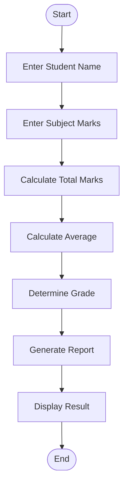
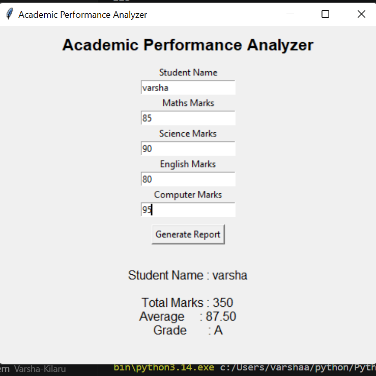

# Mini Project 7: Academic Performance Analyzer

## 1. Problem Statement

Develop a Python application that analyzes student academic records and generates performance reports.

---

## 2. Algorithm

1. Start the application.
2. Enter Student Name.
3. Enter marks for all subjects.
4. Calculate Total Marks.
5. Calculate Average Marks.
6. Determine Grade.
7. Generate Performance Report.
8. Display Result.
9. End.

---

## 3. Flowchart



---

## 4. Python Source Code
```python 
import tkinter as tk

def generate_report():
    name = name_entry.get()

    m1 = int(marks1.get())
    m2 = int(marks2.get())
    m3 = int(marks3.get())
    m4 = int(marks4.get())

    total = m1 + m2 + m3 + m4
    average = total / 4

    if average >= 90:
        grade = "A+"
    elif average >= 80:
        grade = "A"
    elif average >= 70:
        grade = "B"
    elif average >= 60:
        grade = "C"
    else:
        grade = "D"

    result.config(
        text=f"""
Student Name : {name}

Total Marks : {total}
Average     : {average:.2f}
Grade       : {grade}
"""
    )

root = tk.Tk()
root.title("Academic Performance Analyzer")
root.geometry("500x500")

tk.Label(
    root,
    text="Academic Performance Analyzer",
    font=("Arial", 16, "bold")
).pack(pady=10)

tk.Label(root, text="Student Name").pack()
name_entry = tk.Entry(root)
name_entry.pack()

tk.Label(root, text="Maths Marks").pack()
marks1 = tk.Entry(root)
marks1.pack()

tk.Label(root, text="Science Marks").pack()
marks2 = tk.Entry(root)
marks2.pack()

tk.Label(root, text="English Marks").pack()
marks3 = tk.Entry(root)
marks3.pack()

tk.Label(root, text="Computer Marks").pack()
marks4 = tk.Entry(root)
marks4.pack()

tk.Button(
    root,
    text="Generate Report",
    command=generate_report
).pack(pady=10)

result = tk.Label(root, text="", font=("Arial", 12))
result.pack()

root.mainloop()
```

---

## 5. Sample Input

```text
Student Name : Varsha

Maths    : 85
Science  : 90
English  : 80
Computer : 95
```

## Sample Output

```text
Student Name : Varsha

Total Marks : 350
Average     : 87.50
Grade       : A
```

## Grade Criteria

```text
90 - 100 : A+
80 - 89  : A
70 - 79  : B
60 - 69  : C
Below 60 : D
```
### screenshot
