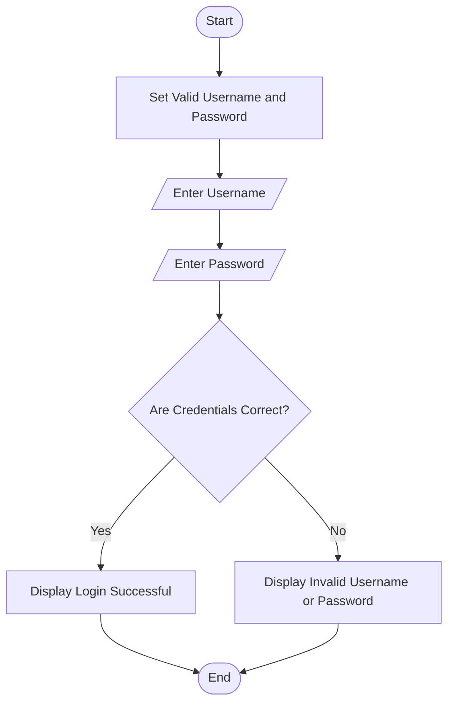
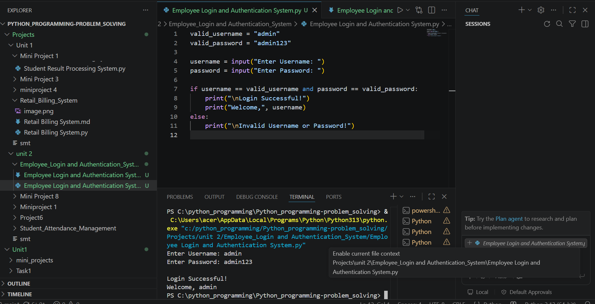

# Mini Project 4: Employee Login and Authentication System

## Problem Statement

Develop a Python application that authenticates employees and manages secure access to organizational resources.

---

## Algorithm

1. Start

2. Define the valid username and password.

3. Input username from the employee.

4. Input password from the employee.

5. Check whether the entered username and password match the stored credentials.

   * If both are correct, display **Login Successful**.
   * Otherwise, display **Invalid Username or Password**.

6. Stop.

---

## Flowchart
````markdown
## Flowchart
````
## Flowchart


````

## Python Source Code

```python
valid_username = "admin"
valid_password = "admin123"

username = input("Enter Username: ")
password = input("Enter Password: ")

if username == valid_username and password == valid_password:
    print("\nLogin Successful!")
    print("Welcome,", username)
else:
    print("\nInvalid Username or Password!")
```

---

## Sample Input/Output

### Input

```text
Enter Username: admin
Enter Password: admin123
```

### Output

```text
Login Successful!
Welcome, admin
```

### Invalid Input

```text
Enter Username: user
Enter Password: 12345
```

### Output

```text
Invalid Username or Password!
```

---

## Screenshot

> 