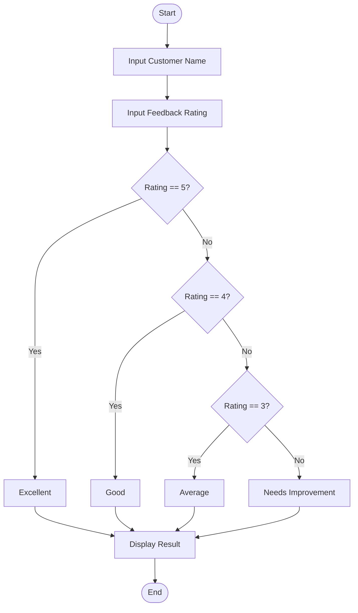
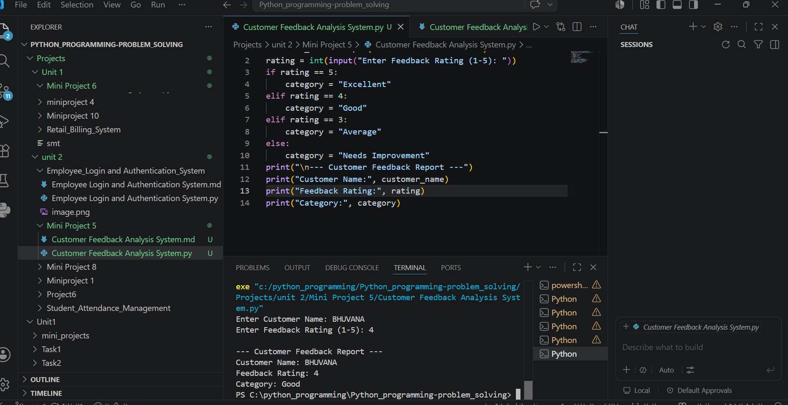

# Mini Project 5: Customer Feedback Analysis System

## Problem Statement

Develop a Python application to collect, analyze, and categorize customer feedback.

---

## Algorithm

1. Start

2. Input customer name.

3. Input feedback rating (1–5).

4. Check the rating:

   * If rating is **5**, feedback is **Excellent**.
   * If rating is **4**, feedback is **Good**.
   * If rating is **3**, feedback is **Average**.
   * Otherwise, feedback is **Needs Improvement**.

5. Display customer name, rating, and feedback category.

6. Stop.

---

## Flowchart





---

## Python Source Code

```python
customer_name = input("Enter Customer Name: ")
rating = int(input("Enter Feedback Rating (1-5): "))

if rating == 5:
    category = "Excellent"
elif rating == 4:
    category = "Good"
elif rating == 3:
    category = "Average"
else:
    category = "Needs Improvement"

print("\n--- Customer Feedback Report ---")
print("Customer Name:", customer_name)
print("Feedback Rating:", rating)
print("Category:", category)
```

---

## Sample Input/Output

### Input

```text
Enter Customer Name: Bhuvana
Enter Feedback Rating (1-5): 5
```

### Output

```text
--- Customer Feedback Report ---
Customer Name: Bhuvana
Feedback Rating: 5
Category: Excellent
```

---

## Screenshot

> Run the program and save the output screenshot as **`screenshot.png`** in the project folder.
