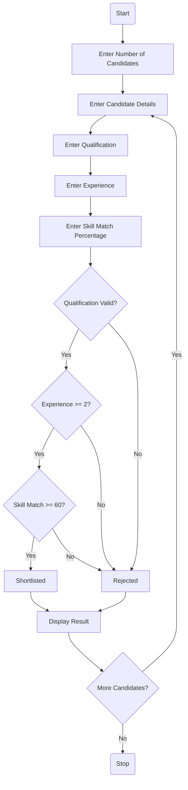
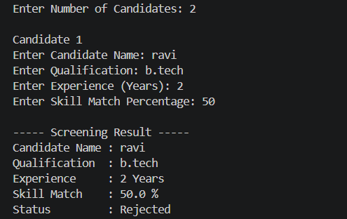
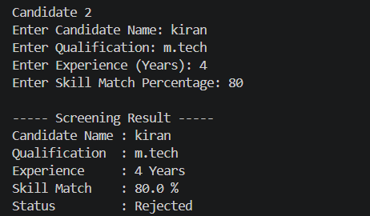

# Mini Project 6: Recruitment Screening System

## 1. Problem Statement

Develop a Python application to evaluate candidate profiles and shortlist eligible applicants based on predefined criteria such as qualification, experience, and skills.

---

# 2. Algorithm

1. Start
2. Input the number of candidates.
3. For each candidate:

   * Input Candidate Name.
   * Input Qualification.
   * Input Years of Experience.
   * Input Skill Match Percentage.
4. Check eligibility:

   * Qualification must be Graduation or above.
   * Experience must be at least 2 years.
   * Skill Match Percentage must be at least 60%.
5. If all conditions are satisfied:

   * Mark candidate as **Shortlisted**.
6. Otherwise:

   * Mark candidate as **Rejected**.
7. Display candidate details and result.
8. Stop.

---

# 3. Flowchart (Mermaid Code)

---

# 4. Python Source Code

```python
# Recruitment Screening System

n = int(input("Enter Number of Candidates: "))

for i in range(n):

    print("\nCandidate", i + 1)

    name = input("Enter Candidate Name: ")
    qualification = input("Enter Qualification: ")
    experience = int(input("Enter Experience (Years): "))
    skill_match = float(input("Enter Skill Match Percentage: "))

    if (qualification.lower() in ["btech", "bsc", "bca", "mtech", "msc", "mca"]) and experience >= 2 and skill_match >= 60:
        result = "Shortlisted"
    else:
        result = "Rejected"

    print("\n----- Screening Result -----")
    print("Candidate Name :", name)
    print("Qualification  :", qualification)
    print("Experience     :", experience, "Years")
    print("Skill Match    :", skill_match, "%")
    print("Status         :", result)
```

---

# 5. Sample Input/Output

### Sample Input

```
Enter Number of Candidates: 2

Candidate 1
Enter Candidate Name: Ravi
Enter Qualification: BTech
Enter Experience (Years): 3
Enter Skill Match Percentage: 75

Candidate 2
Enter Candidate Name: Priya
Enter Qualification: Intermediate
Enter Experience (Years): 1
Enter Skill Match Percentage: 55
```

### Sample Output

```
----- Screening Result -----
Candidate Name : Ravi
Qualification  : BTech
Experience     : 3 Years
Skill Match    : 75.0 %
Status         : Shortlisted

----- Screening Result -----
Candidate Name : Priya
Qualification  : Intermediate
Experience     : 1 Years
Skill Match    : 55.0 %
Status         : Rejected
```

---

# 6. Screenshots


