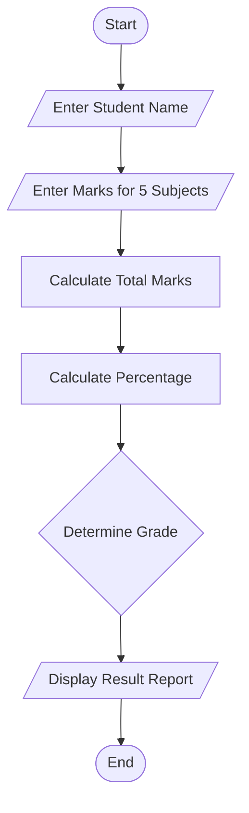
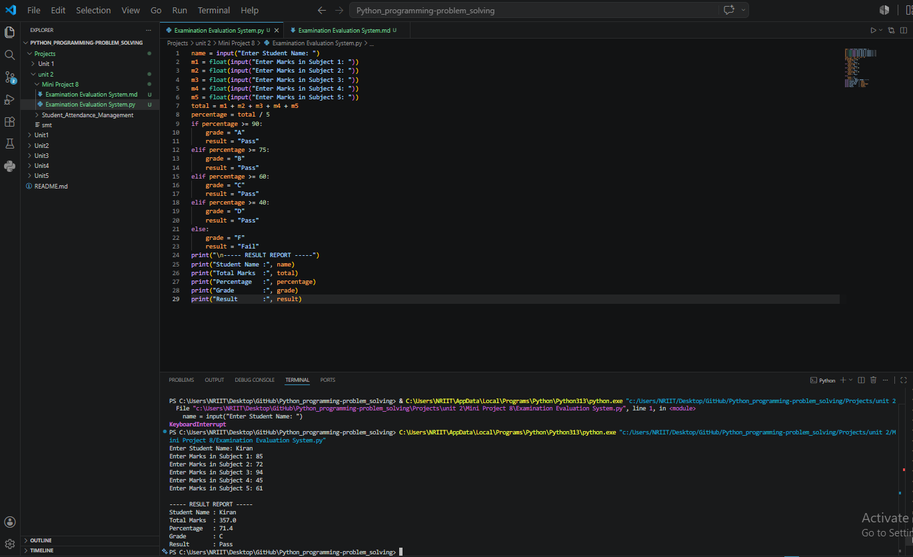

## Mini Project 8: Examination Evaluation System

## 1. Problem Statement

Develop a Python application to assess examination responses and 
generate result reports. 

## 2. Algorithm

1. Start the program.
2. Input student name.
3. Input marks for five subjects.
4. Calculate total marks.
5. Calculate percentage.
6. Determine grade:
7. Percentage ≥ 90 → Grade A
8. Percentage ≥ 75 → Grade B
9. Percentage ≥ 60 → Grade C
10. Percentage ≥ 40 → Grade D
11. Otherwise → Fail
12. Display result report including total, percentage, grade, and result status.
13. Stop the program.

## 3. Flowchart



## 4. Python Source Code

```
name = input("Enter Student Name: ")

m1 = float(input("Enter Marks in Subject 1: "))
m2 = float(input("Enter Marks in Subject 2: "))
m3 = float(input("Enter Marks in Subject 3: "))
m4 = float(input("Enter Marks in Subject 4: "))
m5 = float(input("Enter Marks in Subject 5: "))

total = m1 + m2 + m3 + m4 + m5
percentage = total / 5

if percentage >= 90:
    grade = "A"
    result = "Pass"
elif percentage >= 75:
    grade = "B"
    result = "Pass"
elif percentage >= 60:
    grade = "C"
    result = "Pass"
elif percentage >= 40:
    grade = "D"
    result = "Pass"
else:
    grade = "F"
    result = "Fail"

print("\n----- RESULT REPORT -----")
print("Student Name :", name)
print("Total Marks  :", total)
print("Percentage   :", percentage)
print("Grade        :", grade)
print("Result       :", result)
```

## 5. Sample Input/Output

```
Sample Run
Enter Student Name: Kiran
Enter Marks in Subject 1: 85
Enter Marks in Subject 2: 90
Enter Marks in Subject 3: 88
Enter Marks in Subject 4: 80
Enter Marks in Subject 5: 92

----- RESULT REPORT -----
Student Name : Kiran
Total Marks  : 435.0
Percentage   : 87.0
Grade        : B
Result       : Pass
```

## 6. Screenshots

