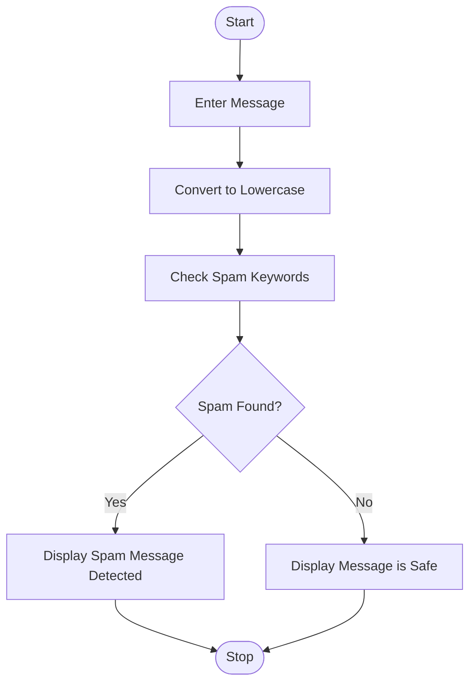

# Spam Detection System

## 1. Problem Statement

Develop a Python application to identify and filter spam messages from user communications.

The program accepts a message from the user, checks for predefined spam keywords, and displays whether the message is **Spam** or **Not Spam**.

---

## 2. Algorithm

1. Start.
2. Enter a message from the user.
3. Convert the message into lowercase.
4. Create a list of spam keywords.
5. Initialize a variable `is_spam` as `False`.
6. Check each keyword in the spam keyword list.
7. If any keyword is found in the message:

   * Set `is_spam = True`.
   * Stop checking further keywords.
8. If `is_spam` is `True`, display **"Spam Message Detected"**.
9. Otherwise, display **"Message is Safe (Not Spam)"**.
10. Stop.

---

## 3. Flowchart



---

## 4. Python Source Code

```python

message = input("Enter a message: ").lower()

spam_keywords = [
    "win",
    "prize",
    "free",
    "lottery",
    "offer",
    "click here",
    "urgent",
    "cash"
]

is_spam = False

for word in spam_keywords:
    if word in message:
        is_spam = True
        break

if is_spam:
    print("Spam Message Detected")
else:
    print("Message is Safe (Not Spam)")
```

---

## 5. Sample Input / Output

### Sample 1

**Input:**

```text
Enter a message: Congratulations! You win a free prize.
```

**Output:**

```text
Spam Message Detected
```

### Sample 2

**Input:**

```text
Enter a message: Hello, how are you today?
```

**Output:**

```text
Message is Safe (Not Spam)
```

---

## 6. Screenshots


