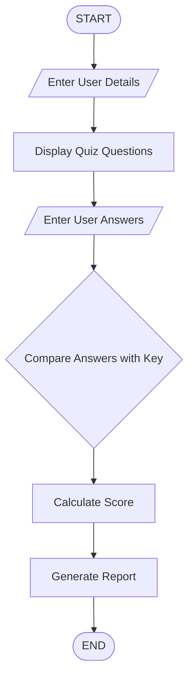

## Online Quiz Management System

## 1. Problem Statement

Develop a Python application to conduct quizzes, evaluate responses, and generate score reports.

## 2. Algorithm

1. Start the program.
2. Accept user name.
3. Display quiz questions with options.
4. Accept user answers.
5. Compare answers with stored correct answers.
6. Calculate total marks.
7. Generate score report.
8. Stop the program.

## 3. Flowchart

## 4. Source Code

questions = [
    "1. Which language is used for AI development?\nA) Python\nB) HTML\nC) CSS\nD) SQL",
    "2. What is the extension of Python files?\nA) .java\nB) .py\nC) .html\nD) .cpp",
    "3. Which keyword is used to define a function in Python?\nA) function\nB) define\nC) def\nD) fun"
]

answers = ["A", "B", "C"]

score = 0

name = input("Enter your name: ")

print("\nWelcome", name)
print("Answer the following questions:")

for i in range(len(questions)):
    print("\n", questions[i])

    user_answer = input("Enter your answer: ")

    if user_answer.upper() == answers[i]:
        score += 1

print("\n----- Score Report -----")

print("Name:", name)
print("Total Questions:", len(questions))
print("Correct Answers:", score)

percentage = (score / len(questions)) * 100

print("Percentage:", percentage,"%")

if percentage >= 80:
    print("Performance: Excellent")

elif percentage >= 50:
    print("Performance: Good")

else:
    print("Performance: Need Improvement")

## 5. Sample Input

Enter your name: Rahul

Question 1:
Which language is used for AI development?
A) Python
B) HTML
C) CSS
D) SQL

Enter your answer: A

Question 2:
What is the extension of Python files?
Enter your answer: B

Question 3:
Which keyword is used to define a function?
Enter your answer: C

## 6. Sample Output
----- Score Report -----

Name: Rahul
Total Questions: 3
Correct Answers: 3
Percentage: 100%

Performance: Excellent

## 7. Screenshot
