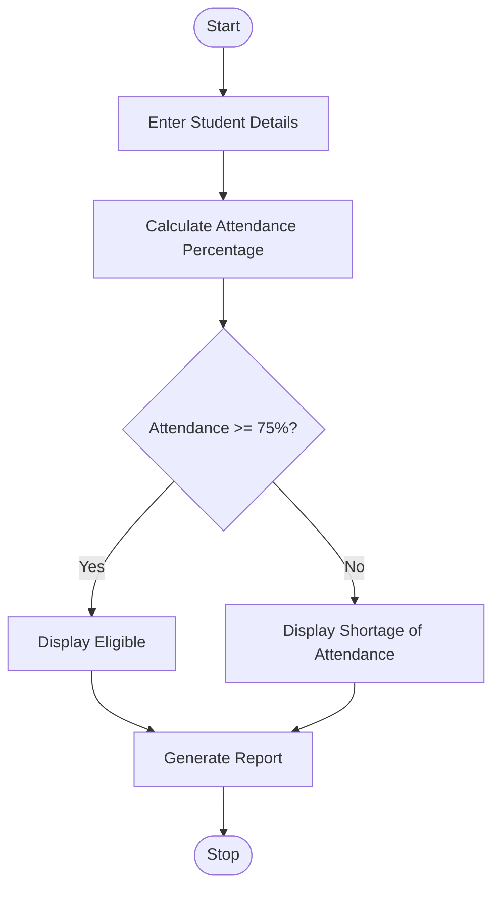
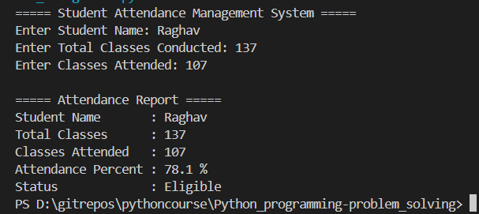
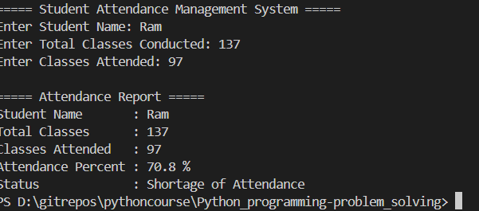

# Student Attendance Management System Using Python

## 1. Problem Statement

Develop a Python application to record student attendance, calculate attendance percentages, and generate attendance reports.

The application should:

* Accept student details.
* Record total classes conducted and classes attended.
* Calculate attendance percentage.
* Generate an attendance report.
* Display attendance status based on percentage.
* Use control structures, strings, and functions.

### Attendance Criteria

* Attendance ≥ 75% → Eligible
* Attendance < 75% → Shortage of Attendance

---

## 2. Algorithm

1. Start the program.

2. Input student name.

3. Input total classes conducted.

4. Input classes attended.

5. Calculate attendance percentage using:

   Attendance Percentage = (Classes Attended / Total Classes) × 100

6. Check attendance percentage.

7. If percentage ≥ 75:

   * Display "Eligible".

8. Otherwise:

   * Display "Shortage of Attendance".

9. Generate attendance report.

10. Stop the program.

---

## 3. Flowchart



---

## 4. Python Source Code

```python
def calculate_percentage(total_classes, attended_classes):
    return (attended_classes / total_classes) * 100

def get_status(percentage):
    if percentage >= 75:
        return "Eligible"
    else:
        return "Shortage of Attendance"

def generate_report(name, total_classes, attended_classes):
    percentage = calculate_percentage(total_classes,attended_classes   )
    status = get_status(percentage)
    print("\n===== Attendance Report =====")
    print("Student Name       :", name)
    print("Total Classes      :", total_classes)
    print("Classes Attended   :", attended_classes)
    print("Attendance Percent :", round(percentage, 2), "%")
    print("Status             :", status)

def main():
    print("===== Student Attendance Management System =====")
    name = input("Enter Student Name: ")
    total_classes = int(input("Enter Total Classes Conducted: "))
    attended_classes = int(input("Enter Classes Attended: "))
    generate_report(name,total_classes,attended_classes)
main()
```

---

## 5. Sample Input/Output

### Example 1

**Input**

```text
Enter Student Name: Rahul
Enter Total Classes Conducted: 100
Enter Classes Attended: 85
```

**Output**

```text
===== Attendance Report =====
Student Name       : Rahul
Total Classes      : 100
Classes Attended   : 85
Attendance Percent : 85.0 %
Status             : Eligible
```

---

### Example 2

**Input**

```text
Enter Student Name: Priya
Enter Total Classes Conducted: 100
Enter Classes Attended: 60
```

**Output**

```text
===== Attendance Report =====
Student Name       : Priya
Total Classes      : 100
Classes Attended   : 60
Attendance Percent : 60.0 %
Status             : Shortage of Attendance
```

---

## 6. Screenshots

### Screenshot 1: Attendance Above 75%



### Screenshot 2: Attendance Below 75%



---
