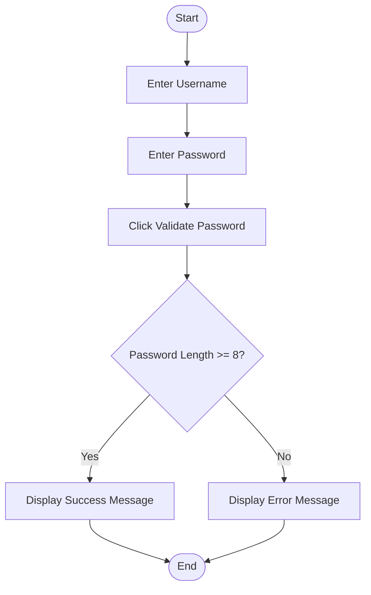
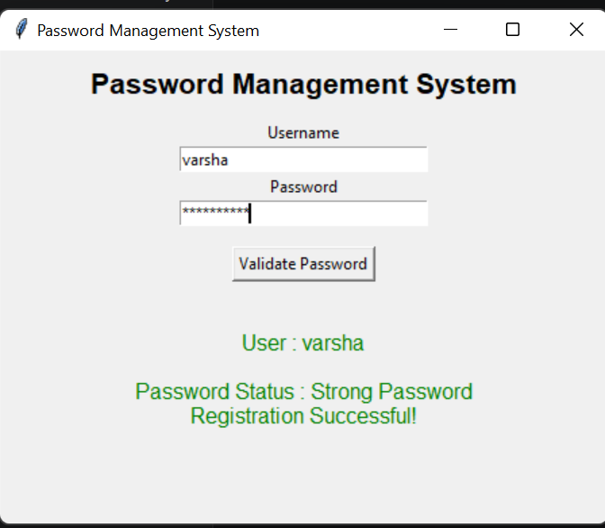

# Mini Project 2: Password Management System

## 1. Problem Statement

Develop a Python application to securely manage and validate user passwords. The application should verify password strength and display whether the password is valid.

---

## 2. Algorithm

1. Start the application.
2. Enter Username.
3. Enter Password.
4. Click **Validate Password**.
5. Check whether the password length is at least 8 characters.
6. If valid, display a success message.
7. Otherwise, display an error message.
8. End the application.

---

## 3. Flowchart



---

## 4. Python Source Code

```python
import tkinter as tk
from tkinter import messagebox

def validate_password():
    username = username_entry.get()
    password = password_entry.get()

    if len(password) >= 8:
        result.config(
            text=f"""
User : {username}

Password Status : Strong Password
Registration Successful!
""",
            fg="green"
        )
    else:
        messagebox.showerror(
            "Weak Password",
            "Password must contain at least 8 characters."
        )

root = tk.Tk()
root.title("Password Management System")
root.geometry("450x350")

tk.Label(root,
text="Password Management System",
font=("Arial",16,"bold")).pack(pady=10)

tk.Label(root,text="Username").pack()
username_entry=tk.Entry(root,width=30)
username_entry.pack()

tk.Label(root,text="Password").pack()
password_entry=tk.Entry(root,width=30,show="*")
password_entry.pack()

tk.Button(root,
text="Validate Password",
command=validate_password).pack(pady=15)

result=tk.Label(root,text="")
result.pack()

root.mainloop()
```

---

## 5. Sample Input

```text
Username : Varsha
Password : Varsha@123
```

## Sample Output

```text
User : Varsha

Password Status : Strong Password
Registration Successful!
```

### screenshot
