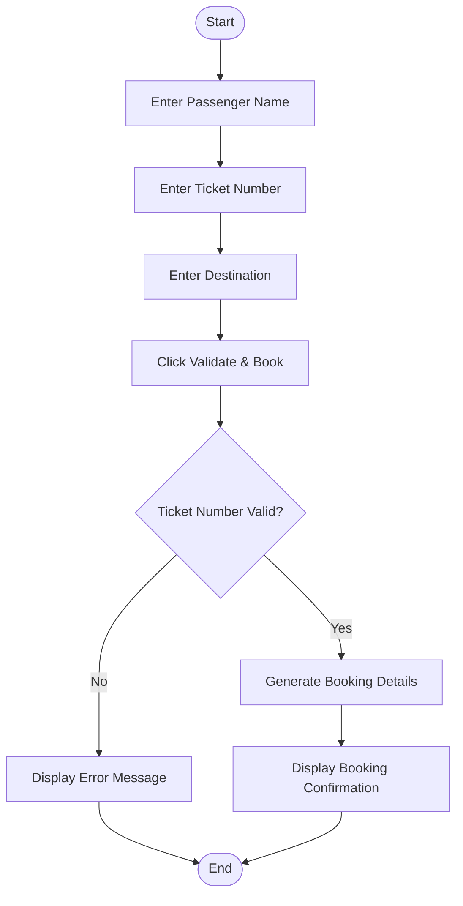
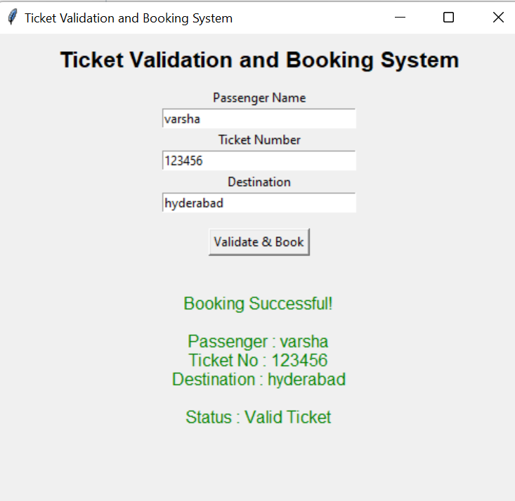

# Mini Project 7: Ticket Validation and Booking System

## 1. Problem Statement

Develop a Python application to validate tickets and manage booking information. The application should verify the ticket number, store passenger details, and display booking confirmation.

---

## 2. Algorithm

1. Start the application.
2. Enter Passenger Name.
3. Enter Ticket Number.
4. Enter Destination.
5. Click **Validate & Book**.
6. Check whether the ticket number contains exactly 6 digits.
7. If valid, display booking details.
8. Otherwise, display an error message.
9. End the application.

---

## 3. Flowchart



---

## 4. Python Source Code

```python
import tkinter as tk
from tkinter import messagebox

def validate_ticket():
    name = name_entry.get()
    ticket = ticket_entry.get()
    destination = destination_entry.get()

    if ticket.isdigit() and len(ticket) == 6:
        result.config(
            text=f"""
Booking Successful!

Passenger : {name}
Ticket No : {ticket}
Destination : {destination}

Status : Valid Ticket
""",
            fg="green"
        )
    else:
        messagebox.showerror(
            "Invalid Ticket",
            "Ticket Number must contain exactly 6 digits."
        )

root = tk.Tk()
root.title("Ticket Validation and Booking System")
root.geometry("500x450")

tk.Label(root,
text="Ticket Validation and Booking System",
font=("Arial",16,"bold")).pack(pady=10)

tk.Label(root,text="Passenger Name").pack()
name_entry=tk.Entry(root,width=30)
name_entry.pack()

tk.Label(root,text="Ticket Number").pack()
ticket_entry=tk.Entry(root,width=30)
ticket_entry.pack()

tk.Label(root,text="Destination").pack()
destination_entry=tk.Entry(root,width=30)
destination_entry.pack()

tk.Button(root,
text="Validate & Book",
command=validate_ticket).pack(pady=15)

result=tk.Label(root,text="")
result.pack()

root.mainloop()
```

---

## 5. Sample Input

```text
Passenger Name : Varsha
Ticket Number  : 123456
Destination    : Hyderabad
```

## Sample Output

```text
Booking Successful!

Passenger : Varsha
Ticket No : 123456
Destination : Hyderabad

Status : Valid Ticket
```
````
### screenshot
