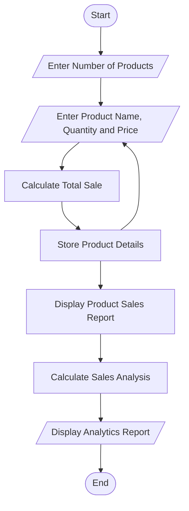

# Mini Project 10: Smart Data Processing Dashboard

## 1. Problem Statement

Develop a Python application that collects product sales information, processes the data, performs sales analysis, and generates a summary report.

---

## 2. Objective

The objective of this project is to collect product sales details, calculate total sales for each product, analyze overall sales performance, and generate a simple sales dashboard.

---

## 3. Algorithm

1. Start.
2. Input the number of products.
3. Repeat the following steps for each product:
   - Enter Product Name.
   - Enter Quantity Sold.
   - Enter Price per Unit.
   - Calculate Total Sale = Quantity × Price.
   - Store Product Name and Total Sale.
4. Display all product sales.
5. Calculate:
   - Total Sales
   - Average Sales
   - Highest Sale
   - Lowest Sale
6. Display the sales analysis report.
7. Stop.

---

## 4. Flowchart



---

## 5. Python Source Code

```python
print("=" * 50)
print(" SMART DATA PROCESSING DASHBOARD ")
print("=" * 50)

products = []
sales = []

n = int(input("Enter Number of Products: "))

for i in range(n):
    print("\nProduct", i + 1)

    product = input("Enter Product Name: ")
    quantity = int(input("Enter Quantity Sold: "))
    price = float(input("Enter Price per Unit: "))

    total = quantity * price

    products.append(product)
    sales.append(total)

print("\n" + "=" * 50)
print("PRODUCT SALES REPORT")
print("=" * 50)

for i in range(n):
    print(products[i], "=", sales[i])

total_sales = sum(sales)
average_sales = total_sales / n
highest_sale = max(sales)
lowest_sale = min(sales)

highest_product = products[sales.index(highest_sale)]
lowest_product = products[sales.index(lowest_sale)]

print("\n" + "=" * 50)
print("SALES ANALYSIS")
print("=" * 50)

print("Total Sales        :", total_sales)
print("Average Sales      :", round(average_sales, 2))
print("Highest Sale       :", highest_sale)
print("Highest Selling Product :", highest_product)
print("Lowest Sale        :", lowest_sale)
print("Lowest Selling Product  :", lowest_product)

print("=" * 50)
print("THANK YOU")
print("=" * 50)
```

---

## 6. Sample Input

```text
Enter Number of Products: 3

Product 1
Enter Product Name: Laptop
Enter Quantity Sold: 2
Enter Price per Unit: 50000

Product 2
Enter Product Name: Mobile
Enter Quantity Sold: 5
Enter Price per Unit: 18000

Product 3
Enter Product Name: Headphones
Enter Quantity Sold: 10
Enter Price per Unit: 2000
```

---

## 7. Sample Output

```text
==================================================
 SMART DATA PROCESSING DASHBOARD
==================================================

PRODUCT SALES REPORT

Laptop = 100000.0
Mobile = 90000.0
Headphones = 20000.0

==================================================
SALES ANALYSIS
==================================================
Total Sales : 210000.0
Average Sales : 70000.0
Highest Sale : 100000.0
Highest Selling Product : Laptop
Lowest Sale : 20000.0
Lowest Selling Product : Headphones
==================================================
THANK YOU
==================================================
```

---

## 8. Screenshot

.png>)

## 9. Explanation

This project collects product sales information from the user, including product name, quantity sold, and price per unit. It calculates the total sale for each product, stores the data using Python lists, and generates a sales report. Finally, it analyzes the data by calculating the total sales, average sales, highest-selling product, and lowest-selling product.

---

## 10. Software Requirements

- Python 3.x
- Visual Studio Code
- GitHub

---

## 11. Features

- Product data collection
- Sales calculation
- Product sales report
- Total sales calculation
- Average sales calculation
- Highest-selling product identification
- Lowest-selling product identification
- Simple analytics dashboard