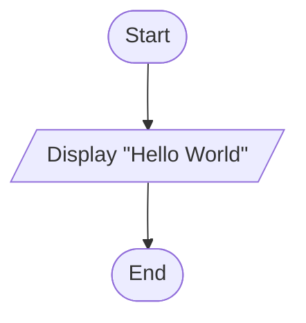
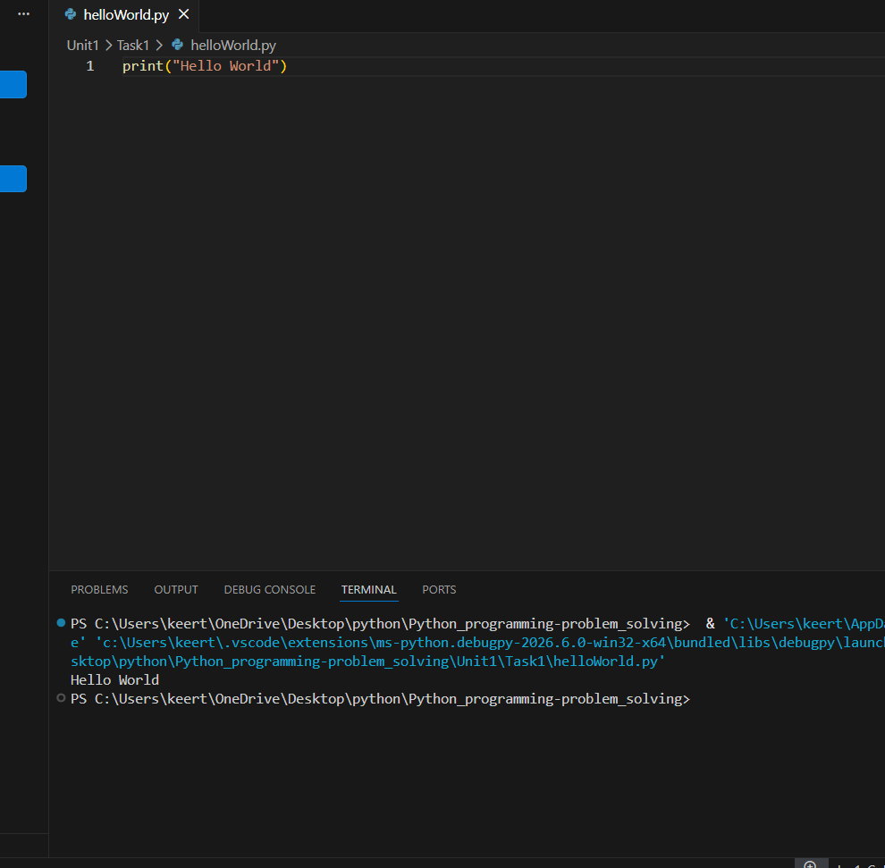

# Tutorial Task 1: Hello World Program

## 1. Problem Statement

Write a Python program to display the message "Hello World" on the screen.

---

## 2. Algorithm

1. Start
2. Display the message "Hello World"
3. Stop

---

## 3. Flowchart



---

## 4. Python Source Code

```python
print("Hello World")
```

---

## 5. Sample Input

```text
No Input Required
```

---

## 6. Sample Output

```text
Hello World
```

---

## 7. Screenshot



---

## 8. Explanation

The program uses the print() function to display the message "Hello World" on the screen. It is the simplest Python program and is commonly used as a beginner's introduction to programming.

---

## 9. Software Requirements

- Python 3.x
- Visual Studio Code
- GitHub