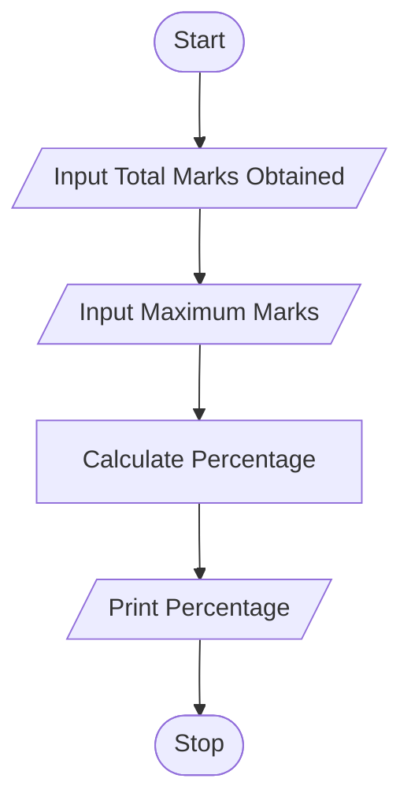

# Tutorial Task 10: Percentage Calculator

## 1. Problem Statement

Write a Python program to calculate the percentage of marks obtained in an examination.

---

## 2. Algorithm

1. Start
2. Input the total marks obtained by the student
3. Input the maximum marks
4. Calculate Percentage = (Total Marks / Maximum Marks) × 100
5. Display the percentage
6. Stop

---

## 3. Flowchart



## 4. Python Source Code

```python
total_marks = float(input("Enter Total Marks Obtained: "))
max_marks = float(input("Enter Maximum Marks: "))

percentage = (total_marks / max_marks) * 100

print("Percentage =", percentage)
```

---

## 5. Sample Input/Output

### Input

```text
Enter Total Marks Obtained: 425
Enter Maximum Marks: 500
```

### Output

```text
Percentage = 85.0
```


