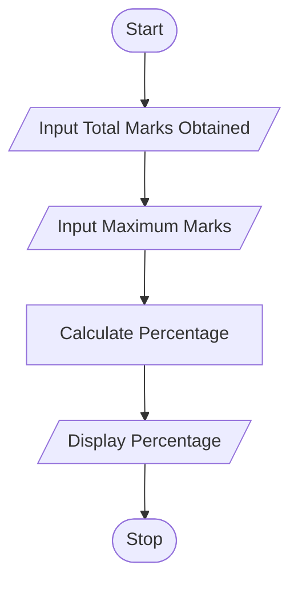

# Tutorial Task 10: Percentage Calculator

## 1. Problem Statement

Write a Python program to calculate the percentage of marks obtained in an examination.

---

## 2. Algorithm

1. Start
2. Input Total Marks Obtained
3. Input Maximum Marks
4. Calculate Percentage
5. Display Percentage
6. Stop

---

## 3. Flowchart

### Mrmaid Flowchart Code (.md)



---

## 4. Python Source Code

```python
total_marks = float(input("Enter Total Marks Obtained: "))
max_marks = float(input("Enter Maximum Marks: "))

percentage = (total_marks / max_marks) * 100

print("Percentage =", percentage)
```

---

## 5. Sample Input/Output
### Input

```python
Enter Total Marks Obtained: 425
Enter Maximum Marks: 500
```

### Output

```python
Percentage = 85.0
```

### Screenshot


