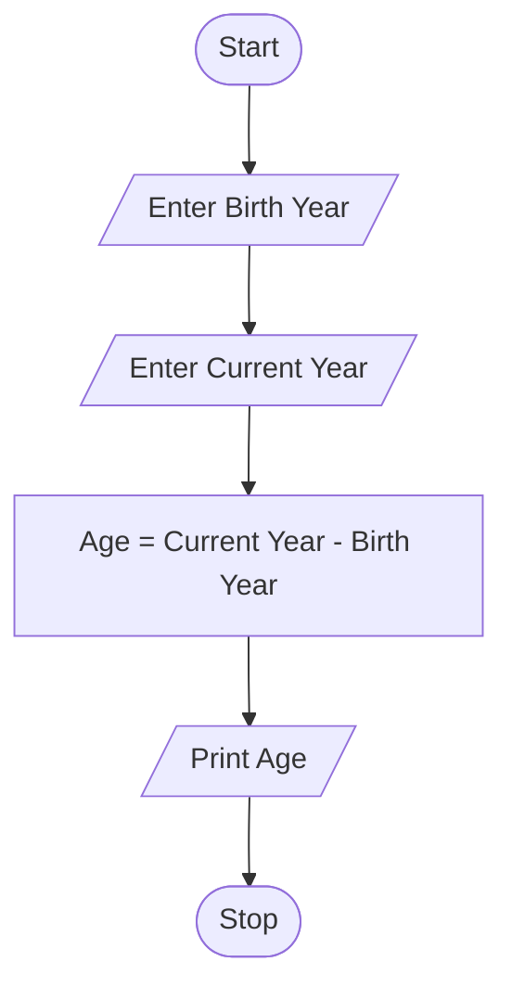
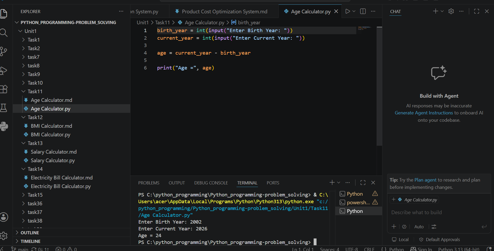

# Tutorial Task 11: Age Calculator

## 1. Problem Statement

Write a Python program to calculate the age of a person using the year of birth and current year.

---

## 2. Algorithm

1. Start
2. Input Birth Year
3. Input Current Year
4. Calculate Age = Current Year − Birth Year
5. Display Age
6. Stop

---

## 3. Flowchart




---

## 5. Python Source Code

```python
birth_year = int(input("Enter Birth Year: "))
current_year = int(input("Enter Current Year: "))

age = current_year - birth_year

print("Age =", age)
```

---

## 6. Sample Input/Output

### Input

```text
Enter Birth Year: 2004
Enter Current Year: 2026
```

### Output

```text
Age = 22
```
##screenshot
