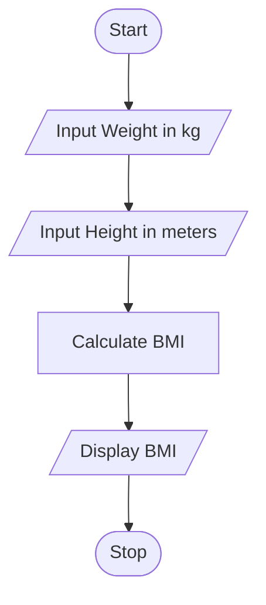
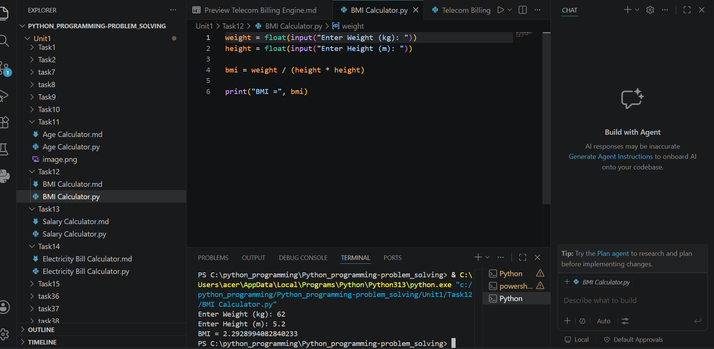

# Tutorial Task 12: BMI Calculator

## 1. Problem Statement

Write a Python program to calculate the Body Mass Index (BMI) using weight and height and display the result.

---

## 2. Algorithm

1. Start
2. Input weight in kilograms
3. Input height in meters
4. Calculate BMI using the formula:
   BMI = Weight / (Height × Height)
5. Display BMI
6. Stop

---

## 3. Flowchart




---

## 4. Python Source Code

```python
weight = float(input("Enter Weight (kg): "))
height = float(input("Enter Height (m): "))

bmi = weight / (height * height)

print("BMI =", bmi)
```

---

## 5. Sample Input/Output

### Input

```text
Enter Weight (kg): 60
Enter Height (m): 1.65
```

### Output

```text
BMI = 22.03856749311295
```
### screenshot
