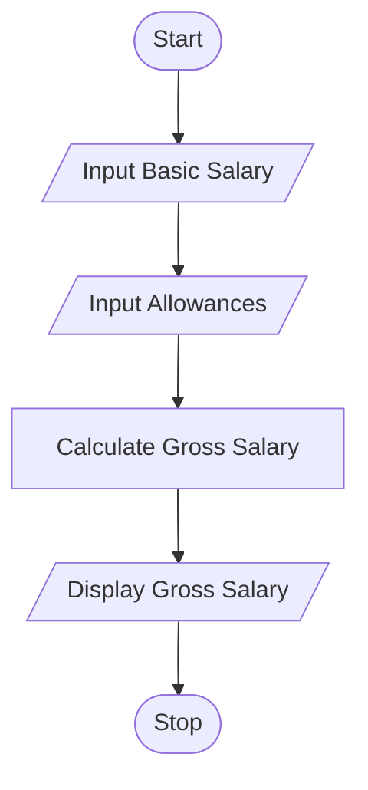
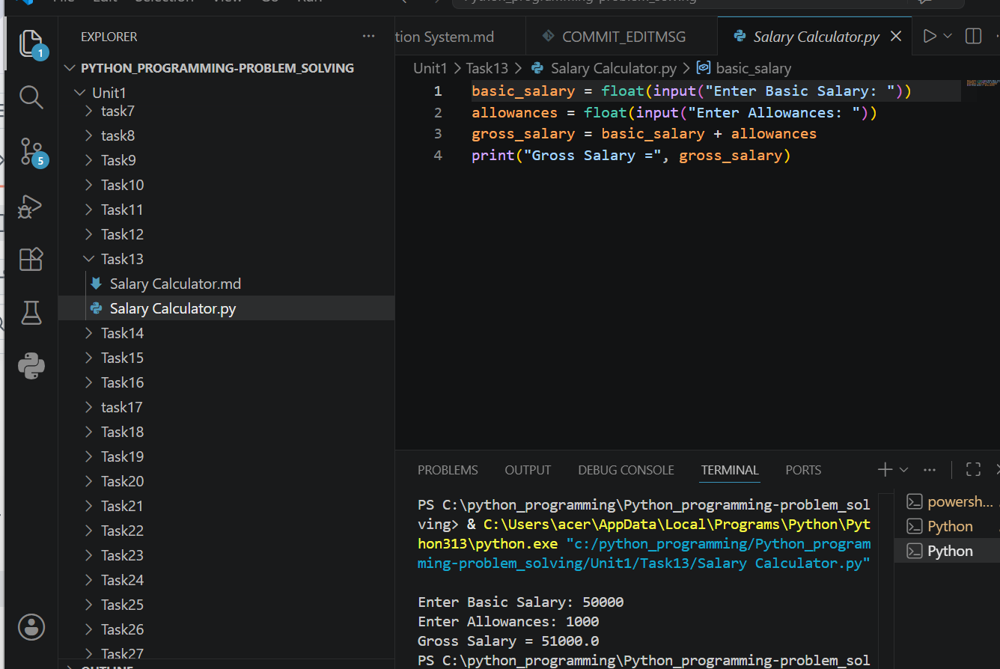

# Tutorial Task 13: Salary Calculator

## 1. Problem Statement

Write a Python program to calculate gross salary based on basic salary and allowances.

---

## 2. Algorithm

1. Start
2. Input Basic Salary
3. Input Allowances
4. Calculate Gross Salary = Basic Salary + Allowances
5. Display Gross Salary
6. Stop

---

## 3. Flowchart




---

## 4. Python Source Code

```python
basic_salary = float(input("Enter Basic Salary: "))
allowances = float(input("Enter Allowances: "))

gross_salary = basic_salary + allowances

print("Gross Salary =", gross_salary)
```

---

## 5. Sample Input/Output

### Input

```text
Enter Basic Salary: 25000
Enter Allowances: 5000
```

### Output

```text
Gross Salary = 30000.0
```
## 6. Screenshots
