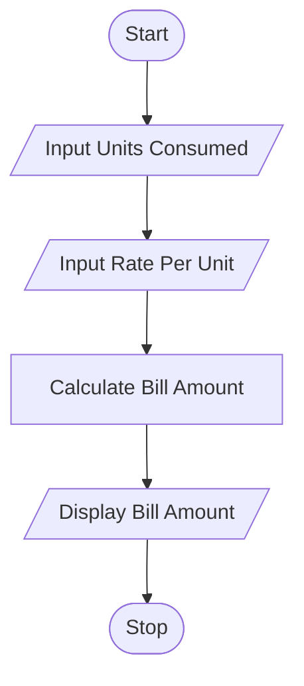

# Tutorial Task 14: Electricity Bill Calculator

## 1. Problem Statement

Write a Python program to calculate the electricity bill amount based on units consumed.

---

## 2. Algorithm

1. Start
2. Input units consumed
3. Input rate per unit
4. Calculate Bill Amount = Units Consumed × Rate per Unit
5. Display Bill Amount
6. Stop

---

## 3. Flowchart




---

## 4. Python Source Code

```python
units = float(input("Enter Units Consumed: "))
rate = float(input("Enter Rate Per Unit: "))

bill_amount = units * rate

print("Electricity Bill Amount =", bill_amount)
```

---

## 5. Sample Input/Output

### Input

```text
Enter Units Consumed: 250
Enter Rate Per Unit: 6
```

### Output

```text
Electricity Bill Amount = 1500.0
```
