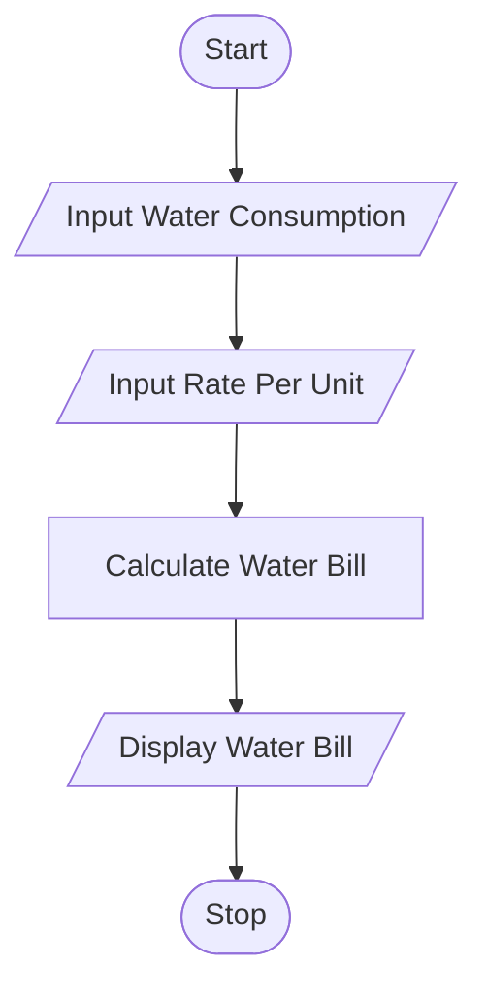
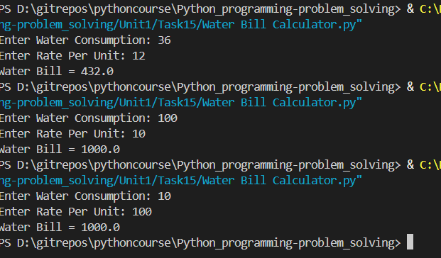

# Tutorial Task 15: water Bill Calculator

## 1. Problem Statement

Write a Python program to calculate the monthly water bill based on water consumption.

---

## 2. Algorithm

1. Start
2. Input water consumption
3. Input rate per unit
4. Calculate Water Bill = Water Consumption × Rate per Unit
5. Display Water Bill
6. Stop

---

## 3. Flowchart

### Mermaid Flowchart Code (.md)



---

## 4. Python Source Code

```python
water_consumption = float(input("Enter Water Consumption: "))
rate = float(input("Enter Rate Per Unit: "))

water_bill = water_consumption * rate

print("Water Bill =", water_bill)
```

---

## 5. Sample Input/Output

### Input

```text
Enter Water Consumption: 150
Enter Rate Per Unit: 5
```

### Output

```text
Water Bill = 750.0
```
## 6. Screenshots
