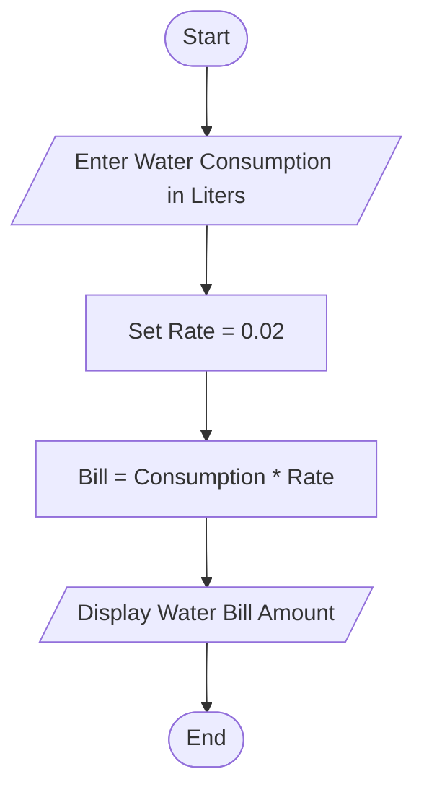
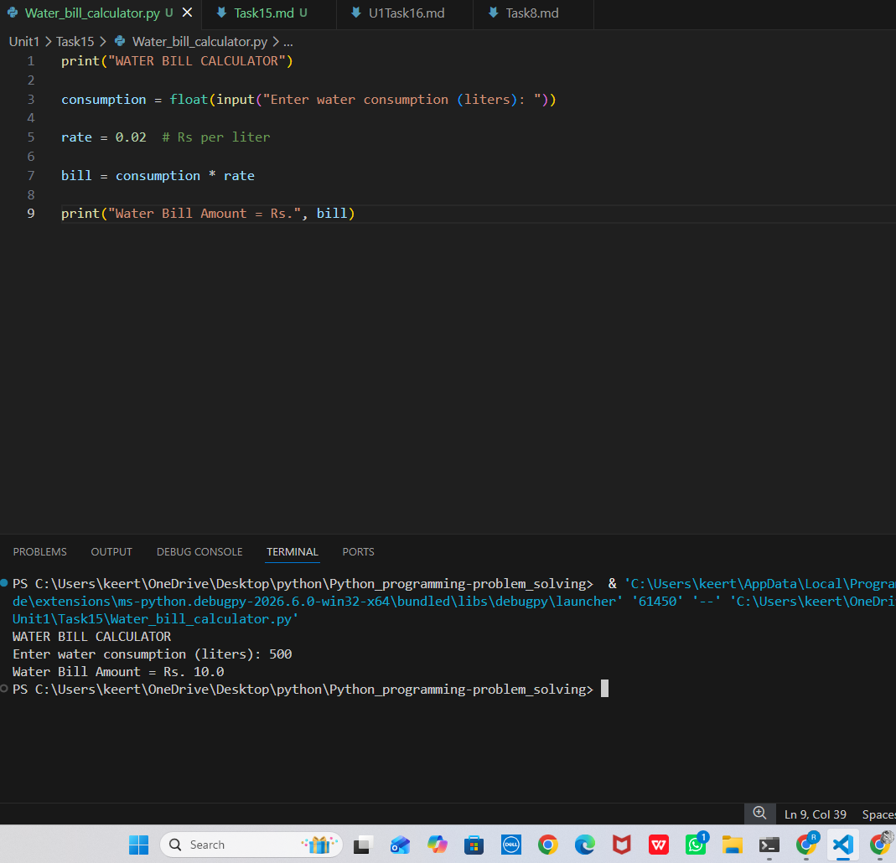

# Tutorial Task 15: Water Bill Calculator

## 1. Problem Statement

Develop a Python program to calculate the monthly water bill based on water consumption.

## 2. Algorithm

1. Start
2. Input water consumption in liters
3. Set water rate per liter as 0.02
4. Calculate bill amount

   Bill = Consumption × Rate

5. Display the bill amount
6. Stop

## 3. Flowchart

## 4. Python Source Code

print("WATER BILL CALCULATOR")

consumption = float(input("Enter water consumption (liters): "))

rate = 0.02

bill = consumption * rate

print("Water Bill Amount = Rs.", bill)

## 5. Sample Input

Enter water consumption (liters): 500

## 6. Sample Output

Water Bill Amount = Rs. 10.0

## 7. Screenshot

## 8. Explanation

The program accepts water consumption in liters from the user and calculates the total water bill using a fixed rate of ₹0.02 per liter. The calculated bill amount is then displayed on the screen.

## 9. Software Requirements

- Python 3.x
- Visual Studio Code
- GitHub!