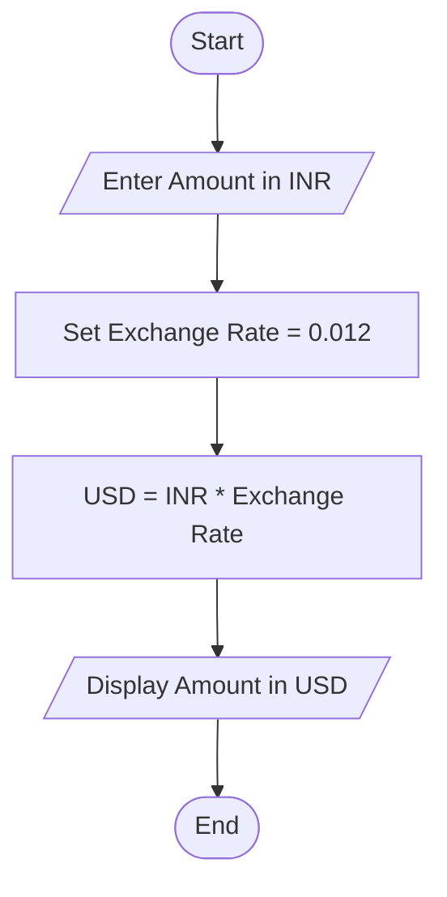
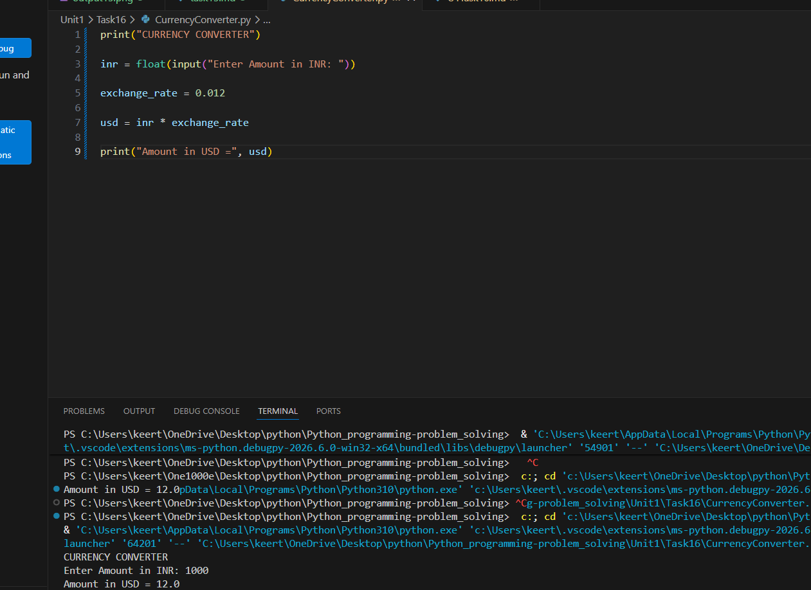

# Tutorial Task 16: Currency Converter

## 1. Problem Statement

Develop a Python program to convert an amount from Indian Rupees (INR) to another currency using a fixed exchange rate.

---

## 2. Algorithm

1. Start
2. Input amount in INR
3. Set exchange rate as 0.012
4. Calculate converted amount

   USD = INR × Exchange Rate

5. Display converted amount in USD
6. Stop

---

## 3. Flowchart



---

## 4. Python Source Code

```python
print("CURRENCY CONVERTER")

inr = float(input("Enter Amount in INR: "))

exchange_rate = 0.012

usd = inr * exchange_rate

print("Amount in USD =", usd)
```

---

## 5. Sample Input

```text
Enter Amount in INR: 1000
```


## 6. Sample Output

```text
Amount in USD = 12.0
```


## 7. Screenshot



## 8. Explanation

The program accepts an amount in Indian Rupees from the user and converts it into US Dollars using a fixed exchange rate. The converted amount is then displayed.

---

## 9. Software Requirements

- Python 3.x
- Visual Studio Code
- GitHub