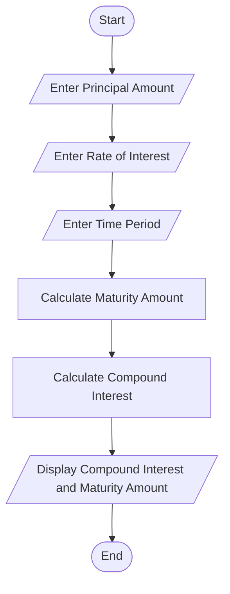
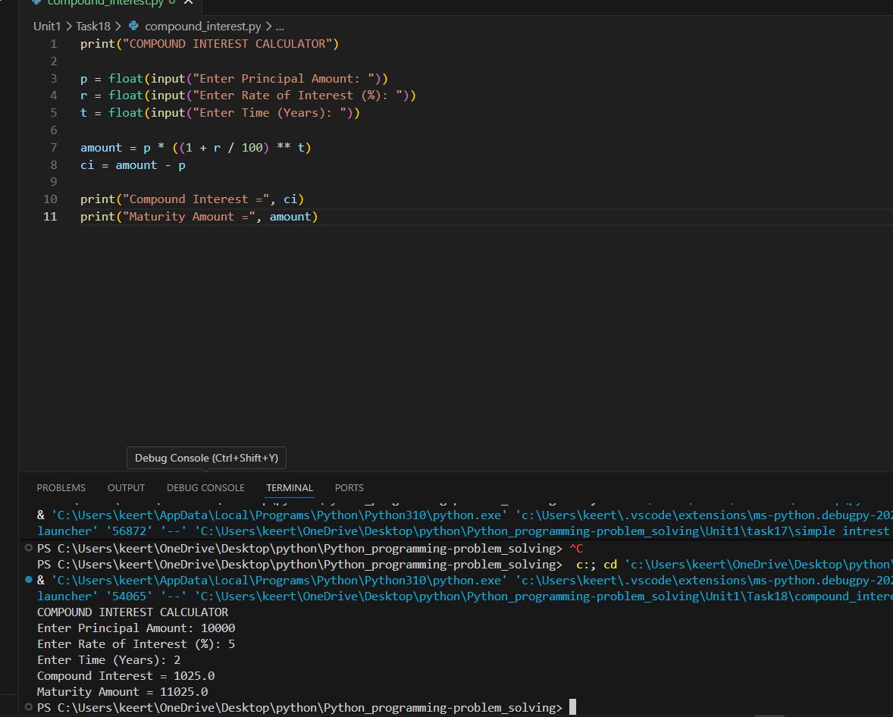

# Tutorial Task 18: Compound Interest Calculator

## 1. Problem Statement

Develop a Python program to calculate compound interest and maturity amount.

---

## 2. Algorithm

1. Start
2. Input Principal Amount (P)
3. Input Rate of Interest (R)
4. Input Time Period (T)
5. Calculate Maturity Amount

   A = P × (1 + R/100)^T

6. Calculate Compound Interest

   CI = A - P

7. Display Compound Interest and Maturity Amount
8. Stop

---

## 3. Flowchart



## 4. Python Source Code

```python
print("COMPOUND INTEREST CALCULATOR")

p = float(input("Enter Principal Amount: "))
r = float(input("Enter Rate of Interest (%): "))
t = float(input("Enter Time (Years): "))

amount = p * ((1 + r / 100) ** t)
ci = amount - p

print("Compound Interest =", ci)
print("Maturity Amount =", amount)
```

---

## 5. Sample Input

```text
Enter Principal Amount: 10000
Enter Rate of Interest (%): 5
Enter Time (Years): 2
```

---

## 6. Sample Output

```text
Compound Interest = 1025.0
Maturity Amount = 11025.0
```

---

## 7. Screenshot



---

## 8. Explanation

The program accepts principal amount, rate of interest, and time period from the user. It calculates the maturity amount using the compound interest formula and then determines the compound interest earned. Both values are displayed on the screen.

---

## 9. Software Requirements

- Python 3.x
- Visual Studio Code
- GitHub