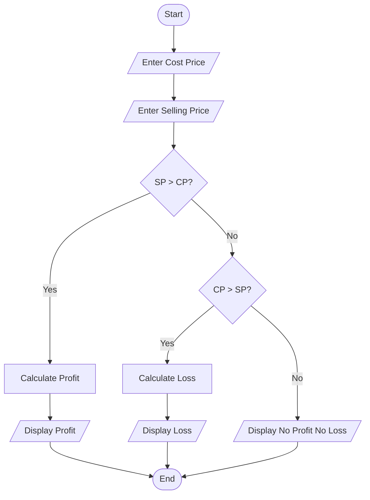
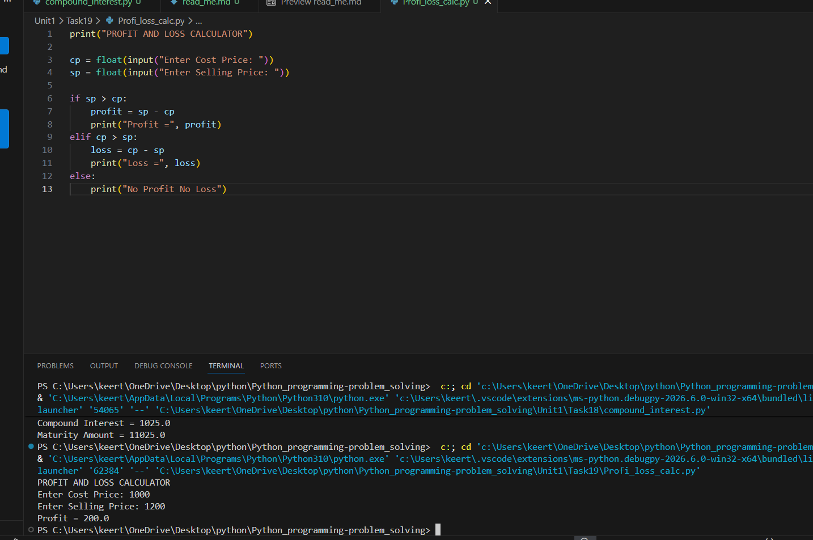

# Tutorial Task 19: Profit and Loss Calculator

## 1. Problem Statement

Develop a Python program to determine profit or loss based on cost price and selling price.

---

## 2. Algorithm

1. Start
2. Input Cost Price (CP)
3. Input Selling Price (SP)
4. Compare SP and CP
5. If SP > CP, calculate Profit = SP - CP
6. If CP > SP, calculate Loss = CP - SP
7. Otherwise display No Profit No Loss
8. Display Result
9. Stop

---

## 3. Flowchart



---

## 4. Python Source Code

```python
print("PROFIT AND LOSS CALCULATOR")

cp = float(input("Enter Cost Price: "))
sp = float(input("Enter Selling Price: "))

if sp > cp:
    profit = sp - cp
    print("Profit =", profit)
elif cp > sp:
    loss = cp - sp
    print("Loss =", loss)
else:
    print("No Profit No Loss")
```

---

## 5. Sample Input

```text
Enter Cost Price: 1000
Enter Selling Price: 1200
```

---

## 6. Sample Output

```text
Profit = 200.0
```

---

## 7. Screenshot



---

## 8. Explanation

The program accepts Cost Price and Selling Price from the user. If the Selling Price is greater than the Cost Price, profit is calculated. If the Cost Price is greater than the Selling Price, loss is calculated. Otherwise, the program displays "No Profit No Loss".

---

## 9. Software Requirements

- Python 3.x
- Visual Studio Code
- GitHub