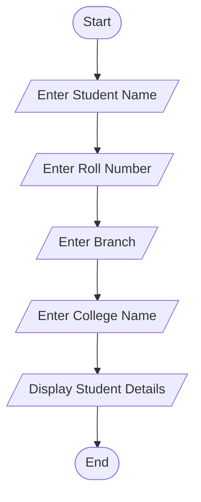
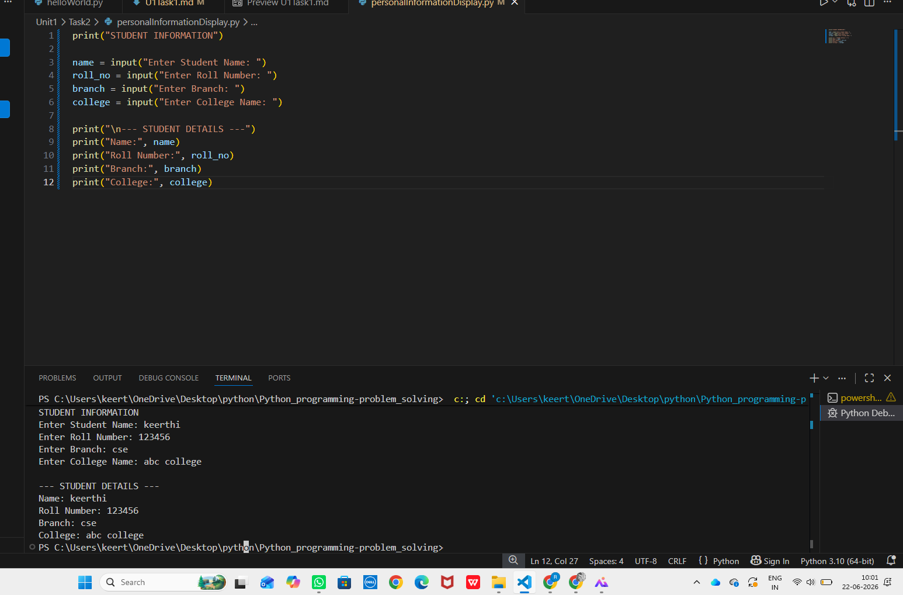

# Tutorial Task 2: Personal Information Display

## 1. Problem Statement

Write a Python program to display a student's personal information including name, roll number, branch, and college name.

---

## 2. Algorithm

1. Start
2. Input student name
3. Input roll number
4. Input branch
5. Input college name
6. Display all student details
7. Stop

---

## 3. Flowchart



---

## 4. Python Source Code

```python
print("STUDENT INFORMATION")

name = input("Enter Student Name: ")
roll_no = input("Enter Roll Number: ")
branch = input("Enter Branch: ")
college = input("Enter College Name: ")

print("\n--- STUDENT DETAILS ---")
print("Name:", name)
print("Roll Number:", roll_no)
print("Branch:", branch)
print("College:", college)
```

---

## 5. Sample Input

```text
Enter Student Name: Keerthi
Enter Roll Number: 22KD1A05E8
Enter Branch: CSE
Enter College Name: NRI Institute of Technology
```

---

## 6. Sample Output

```text
--- STUDENT DETAILS ---
Name: Keerthi
Roll Number: 22KD1A05E8
Branch: CSE
College: NRI Institute of Technology
```

---

## 7. Screenshot



---

## 8. Explanation

The program accepts student information such as name, roll number, branch, and college name from the user and displays the entered details in a formatted manner.

---

## 9. Software Requirements

- Python 3.x
- Visual Studio Code
- GitHub