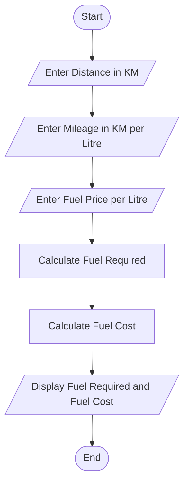
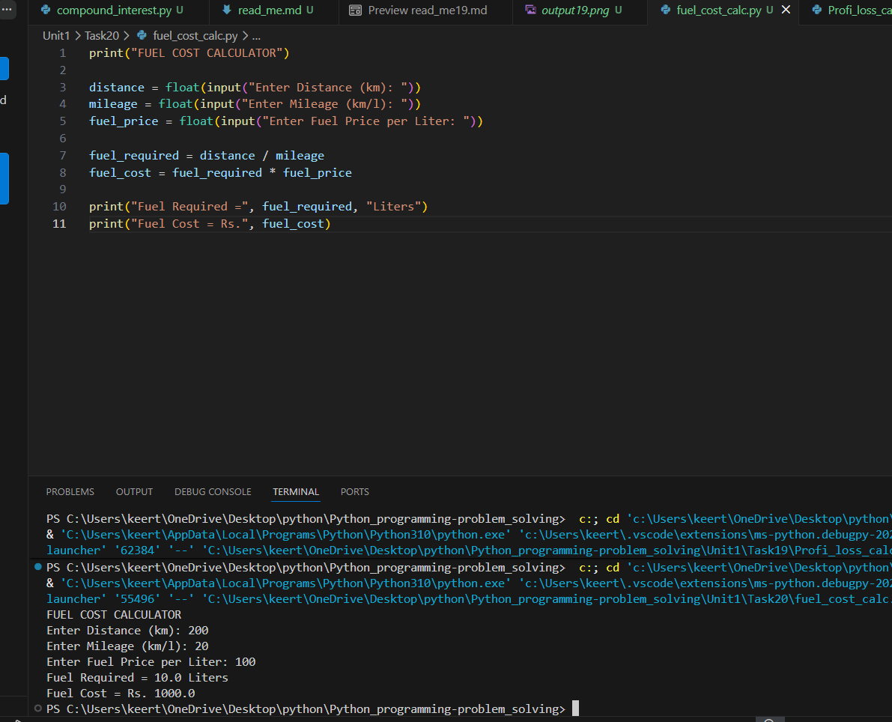

# Tutorial Task 20: Fuel Cost Calculator

## 1. Problem Statement

Develop a Python program to estimate fuel cost based on travel distance, mileage, and fuel price.

---

## 2. Algorithm

1. Start
2. Input travel distance in kilometers
3. Input vehicle mileage in km/litre
4. Input fuel price per litre
5. Calculate fuel required

   Fuel Required = Distance / Mileage

6. Calculate fuel cost

   Fuel Cost = Fuel Required × Fuel Price

7. Display fuel required and fuel cost
8. Stop

---

## 3. Flowchart



---

## 4. Python Source Code

```python
print("FUEL COST CALCULATOR")

distance = float(input("Enter Distance (km): "))
mileage = float(input("Enter Mileage (km/l): "))
fuel_price = float(input("Enter Fuel Price per Liter: "))

fuel_required = distance / mileage
fuel_cost = fuel_required * fuel_price

print("Fuel Required =", fuel_required, "Liters")
print("Fuel Cost = Rs.", fuel_cost)
```

---

## 5. Sample Input

```text
Enter Distance (km): 200
Enter Mileage (km/l): 20
Enter Fuel Price per Liter: 100
```

---

## 6. Sample Output

```text
Fuel Required = 10.0 Liters
Fuel Cost = Rs. 1000.0
```

---

## 7. Screenshot



---

## 8. Explanation

The program accepts travel distance, vehicle mileage, and fuel price from the user. It calculates the fuel required for the journey and then computes the total fuel cost.

---

## 9. Software Requirements

- Python 3.x
- Visual Studio Code
- GitHub