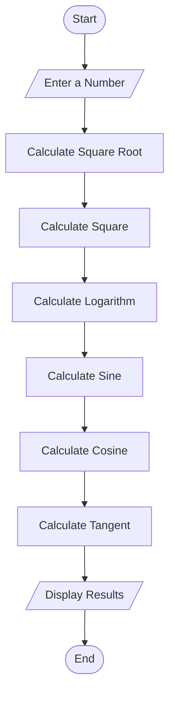
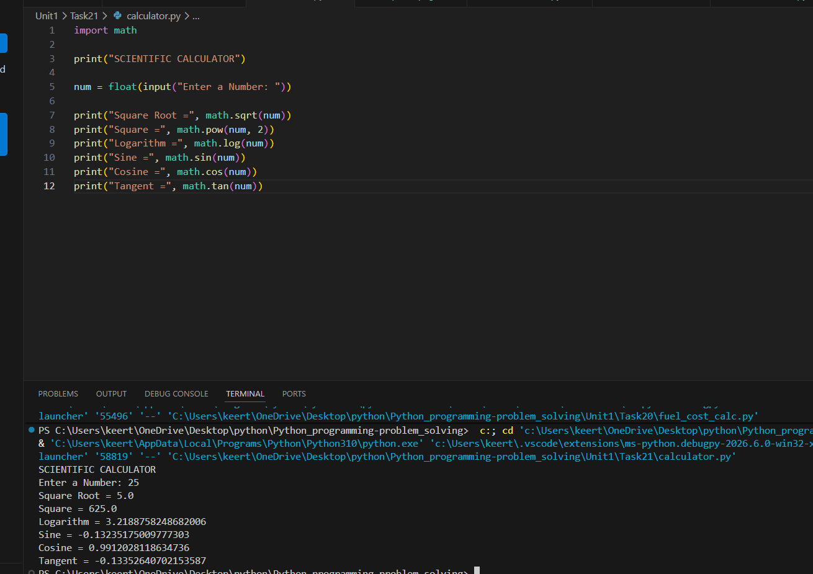

# Tutorial Task 21: Scientific Calculator

## 1. Problem Statement

Develop a Python program that performs scientific calculations including square root, power, logarithmic, and trigonometric operations.

---

## 2. Algorithm

1. Start
2. Input a number
3. Calculate square root
4. Calculate square
5. Calculate logarithm
6. Calculate sine value
7. Calculate cosine value
8. Calculate tangent value
9. Display all results
10. Stop

---

## 3. Flowchart



---

## 4. Python Source Code

```python
import math

print("SCIENTIFIC CALCULATOR")

num = float(input("Enter a Number: "))

print("Square Root =", math.sqrt(num))
print("Square =", math.pow(num, 2))
print("Logarithm =", math.log(num))
print("Sine =", math.sin(num))
print("Cosine =", math.cos(num))
print("Tangent =", math.tan(num))
```

---

## 5. Sample Input

```text
Enter a Number: 25
```

---

## 6. Sample Output

```text
Square Root = 5.0
Square = 625.0
Logarithm = 3.2188758248682006
Sine = -0.13235175009777303
Cosine = 0.9912028118634736
Tangent = -0.13352640702153587
```

---

## 7. Screenshot



---

## 8. Explanation

The program accepts a number from the user and performs scientific calculations such as square root, square, logarithm, sine, cosine, and tangent using Python's built-in math module.

---

## 9. Software Requirements

- Python 3.x
- Visual Studio Code
- GitHub