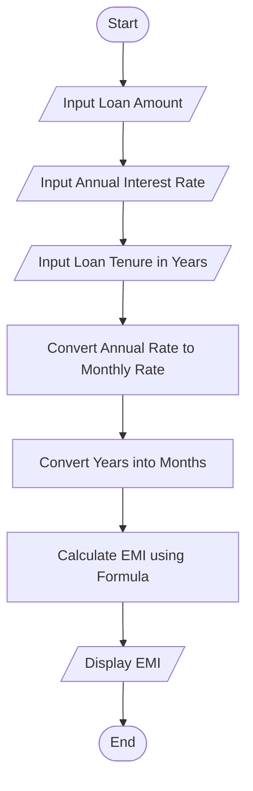

# Loan EMI Calculator

## 1. Problem Statement

Develop a Python program to calculate the Equated Monthly Installment (EMI) for a loan based on the loan amount, annual interest rate, and repayment duration. The program should take user input and display the monthly EMI.

---

## 2. Algorithm

1. Start the program.
2. Input the loan amount (Principal).
3. Input the annual interest rate.
4. Input the loan tenure in years.
5. Convert annual interest rate into monthly rate.
6. Convert loan tenure into months.
7. Apply the EMI formula.
8. Display the EMI amount.
9. End the program.

---

## 3. Flowchart



---

## 4. Python Source Code


principal = float(input("Enter loan amount: "))
annual_rate = float(input("Enter annual interest rate (%): "))
years = int(input("Enter loan tenure (in years): "))

# Convert annual interest rate into monthly rate
monthly_rate = annual_rate / (12 * 100)

# Convert years into months
months = years * 12

# EMI calculation
emi = (principal * monthly_rate * (1 + monthly_rate) ** months) / ((1 + monthly_rate) ** months - 1)

# Display result
print("\nLoan Details:")
print("Principal Amount:", principal)
print("Annual Interest Rate:", annual_rate, "%")
print("Loan Tenure:", years, "years")
print("Monthly EMI: ₹", round(emi, 2))
```

---

## 5. Sample Input/Output

### Input:

```text
Enter loan amount: 500000
Enter annual interest rate (%): 8.5
Enter loan tenure (in years): 5
```

### Output:

```text
Loan Details:
Principal Amount: 500000.0
Annual Interest Rate: 8.5 %
Loan Tenure: 5 years
Monthly EMI: ₹ 10258.34
```

---

## 6. Screenshots
