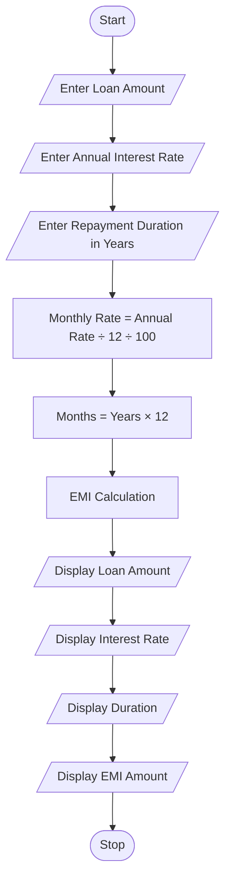
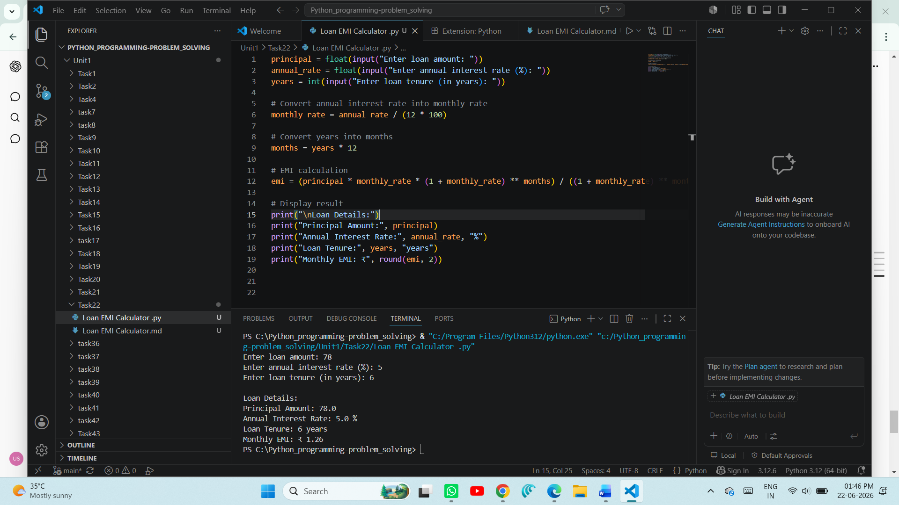
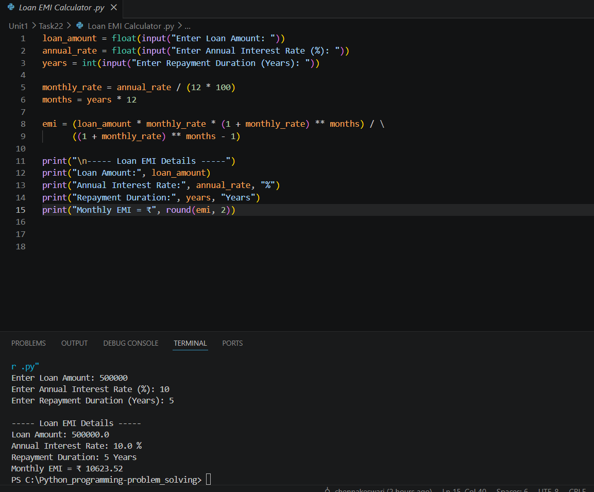

# Loan EMI Calculator

## 1. Problem Statement

Develop a Python program to calculate the Equated Monthly Installment (EMI) for a given loan amount, interest rate, and repayment duration.

The program should accept the loan amount, annual interest rate, and repayment period from the user and display the monthly EMI amount.

---

## 2. Algorithm

1. Start

2. Input loan amount

3. Input annual interest rate

4. Input repayment duration (in years)

5. Convert annual interest rate into monthly interest rate

   * Monthly Rate = Annual Rate / (12 × 100)

6. Convert repayment duration into months

   * Number of Months = Years × 12

7. Calculate EMI using the formula

   * EMI = P × R × (1 + R)^N / ((1 + R)^N − 1)

   Where:

   * P = Loan Amount
   * R = Monthly Interest Rate
   * N = Number of Months

8. Display loan details and EMI amount

9. Stop

---

## 3. Flowchart



---

## 4. Python Source Code

```python
loan_amount = float(input("Enter Loan Amount: "))
annual_rate = float(input("Enter Annual Interest Rate (%): "))
years = int(input("Enter Repayment Duration (Years): "))

monthly_rate = annual_rate / (12 * 100)
months = years * 12

emi = (loan_amount * monthly_rate * (1 + monthly_rate) ** months) / \
      ((1 + monthly_rate) ** months - 1)

print("\n----- Loan EMI Details -----")
print("Loan Amount:", loan_amount)
print("Annual Interest Rate:", annual_rate, "%")
print("Repayment Duration:", years, "Years")
print("Monthly EMI = ₹", round(emi, 2))
```

---

## 5. Sample Input / Output

### Sample 1

**Input:**

```text
Enter Loan Amount: 500000
Enter Annual Interest Rate (%): 10
Enter Repayment Duration (Years): 5
```

**Output:**

```text
----- Loan EMI Details -----
Loan Amount: 500000.0
Annual Interest Rate: 10.0 %
Repayment Duration: 5 Years
Monthly EMI = ₹ 10623.52
```

### Sample 2

**Input:**

```text
Enter Loan Amount: 1000000
Enter Annual Interest Rate (%): 8
Enter Repayment Duration (Years): 10
```

**Output:**

```text
----- Loan EMI Details -----
Loan Amount: 1000000.0
Annual Interest Rate: 8.0 %
Repayment Duration: 10 Years
Monthly EMI = ₹ 12132.84
```

---

<<<<<<< HEAD
## 6. Screenshots

=======
## 6. Screenshot



---

## 7. EMI Formula

[
EMI = \frac{P \times R \times (1+R)^N}{(1+R)^N - 1}
]

Where:

* P = Loan Amount
* R = Monthly Interest Rate
* N = Number of Monthly Installments
>>>>>>> 5df6faf600ce9d8abbb59d0a17a3ec772a99c307
