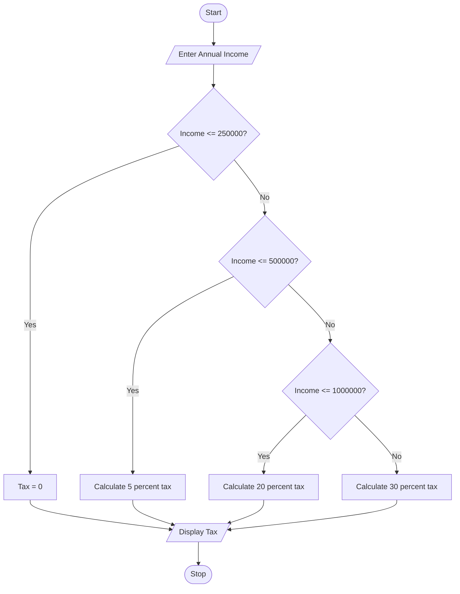

# Income Tax Calculator

## 1. Problem Statement

Develop a Python program to calculate the income tax payable based 
on annual income and applicable tax slabs. 

---

## 2. Algorithm

1. Start
2. Input annual income
3. Check the income slab:

   * If income ≤ ₹2,50,000 → Tax = 0
   * If income ≤ ₹5,00,000 → Tax = 5% of amount above ₹2,50,000
   * If income ≤ ₹10,00,000 → Tax = ₹12,500 + 20% of amount above ₹5,00,000
   * If income > ₹10,00,000 → Tax = ₹1,12,500 + 30% of amount above ₹10,00,000
4. Display the tax payable
5. Stop

---

## 3. Flowchart



---

## 4. Python Source Code

```python
# Income Tax Calculator

income = float(input("Enter Annual Income: "))

if income <= 250000:
    tax = 0

elif income <= 500000:
    tax = (income - 250000) * 0.05

elif income <= 1000000:
    tax = 12500 + (income - 500000) * 0.20

else:
    tax = 112500 + (income - 1000000) * 0.30

print("\nIncome Tax Payable = ₹", tax)
```

---

## 5. Sample Input / Output

### Sample 1:

Input:

```text
Enter Annual Income: 400000
```

Output:

```text
Income Tax Payable = ₹ 7500.0
```

### Sample 2:

Input:

```text
Enter Annual Income: 800000
```

Output:

```text
Income Tax Payable = ₹ 72500.0
```

---

## 6. Screenshots


---
