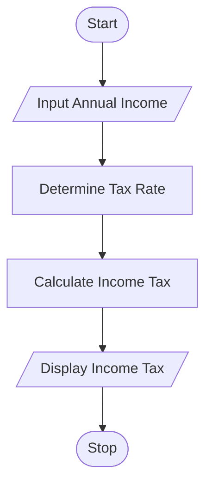

# Tutorial Task 23: Income Tax Calculator

## 1. Problem Statement

Write a Python program to calculate the income tax payable based on annual income and applicable tax slabs.

---

## 2. Algorithm

1. Start
2. Input Annual Income
3. Determine Tax Rate based on Income Slab
4. Calculate Income Tax
5. Display Income Tax
6. Stop

---

## 3. Flowchart

### Mermaid Flowchart Code (.md)



---

## 4. Python Source Code

```python
annual_income = float(input("Enter Annual Income: "))

if annual_income <= 250000:
    tax = 0
elif annual_income <= 500000:
    tax = annual_income * 0.05
elif annual_income <= 1000000:
    tax = annual_income * 0.20
else:
    tax = annual_income * 0.30

print("Income Tax =", tax)
```

---

## 5. Sample Input/Output

### Input

```text
Enter Annual Income: 600000
```

### Output

```text
Income Tax = 120000.0
```

### Screenshot


