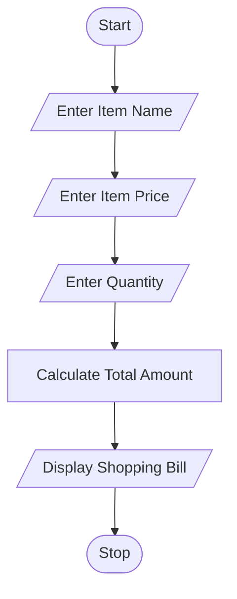

# Shopping Bill Generator

## 1. Problem Statement

Write a Python program to generate a shopping bill by calculating the total cost based on item price and quantity.

---

## 2. Algorithm

1. Start

2. Input item name

3. Input item price

4. Input quantity

5. Calculate total amount:

   * Total = Price × Quantity

6. Display item details and total bill amount

7. Stop

---

## 3. Flowchart



---

## 4. Python Source Code

```python
# Shopping Bill Generator

item_name = input("Enter Item Name: ")
price = float(input("Enter Item Price: "))
quantity = int(input("Enter Quantity: "))

total = price * quantity

print("\n----- Shopping Bill -----")
print("Item Name:", item_name)
print("Item Price:", price)
print("Quantity:", quantity)
print("Total Bill Amount = ₹", total)
```

---

## 5. Sample Input / Output

### Sample 1:

Input:

```text
Enter Item Name: Pen
Enter Item Price: 20
Enter Quantity: 5
```

Output:

```text
----- Shopping Bill -----
Item Name: Pen
Item Price: 20.0
Quantity: 5
Total Bill Amount = ₹ 100.0
```

### Sample 2:

Input:

```text
Enter Item Name: Notebook
Enter Item Price: 50
Enter Quantity: 4
```

Output:

```text
----- Shopping Bill -----
Item Name: Notebook
Item Price: 50.0
Quantity: 4
Total Bill Amount = ₹ 200.0
```

---

## 6. Screenshot

