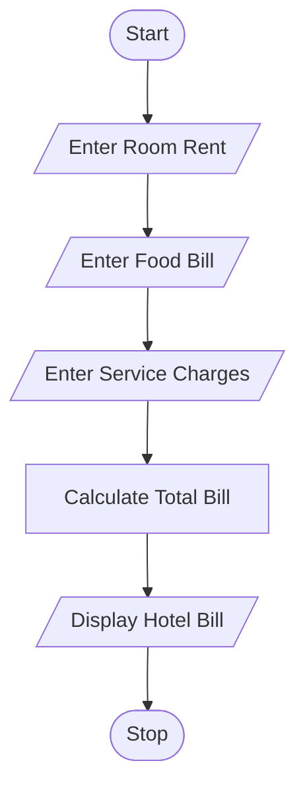
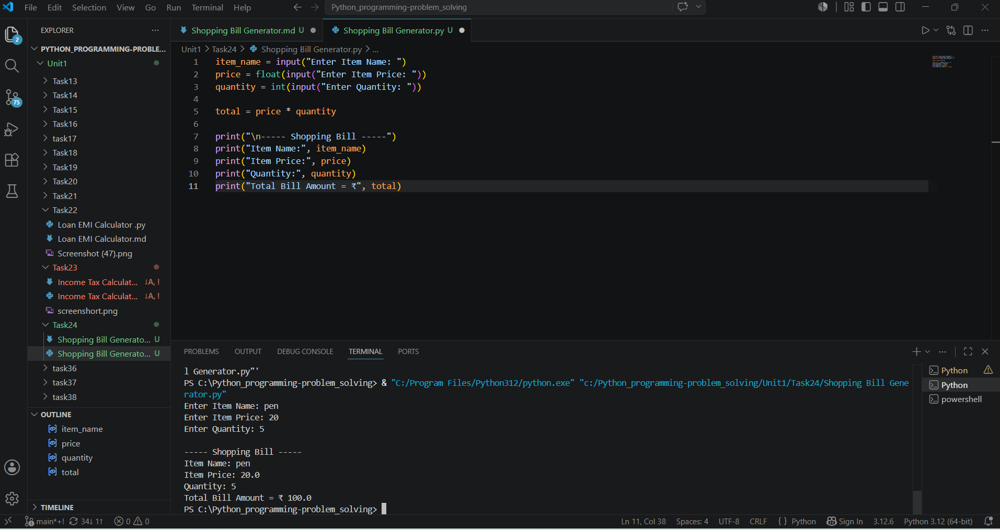

# Hotel Billing System

## 1. Problem Statement

Write a Python program to calculate hotel charges including room rent, food bill, and service charges.

The program should accept room rent, food bill, and service charges from the user and display the total hotel bill.

---

## 2. Algorithm

1. Start

2. Input room rent

3. Input food bill

4. Input service charges

5. Calculate total bill:

   * Total Bill = Room Rent + Food Bill + Service Charges

6. Display all bill details and total amount

7. Stop

---

## 3. Flowchart



---

## 4. Python Source Code

```python id="p7w9sm"

room_rent = float(input("Enter Room Rent: "))
food_bill = float(input("Enter Food Bill: "))
service_charges = float(input("Enter Service Charges: "))
total_bill = room_rent + food_bill + service_charges

print("Room Rent:", room_rent)
print("Food Bill:", food_bill)
print("Service Charges:", service_charges)
print("Total Bill Amount = ₹", total_bill)
```

---

## 5. Sample Input / Output

### Sample 1:

Input:

```text id="0a4rkg"
Enter Room Rent: 2000
Enter Food Bill: 800
Enter Service Charges: 200
```

Output:

```text id="g62czv"
----- Hotel Bill -----
Room Rent: 2000.0
Food Bill: 800.0
Service Charges: 200.0
Total Bill Amount = ₹ 3000.0
```

### Sample 2:

Input:

```text id="76qj2j"
Enter Room Rent: 3500
Enter Food Bill: 1200
Enter Service Charges: 300
```

Output:

```text id="1x24xj"
----- Hotel Bill -----
Room Rent: 3500.0
Food Bill: 1200.0
Service Charges: 300.0
Total Bill Amount = ₹ 5000.0
```

---

## 6. Screenshot
