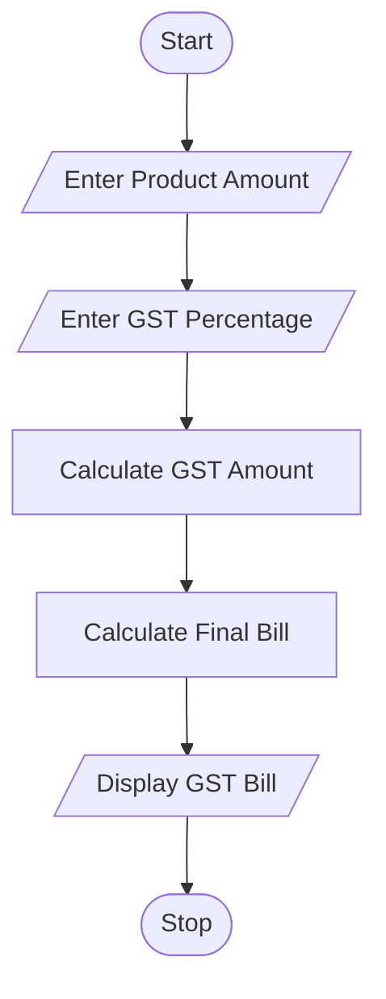
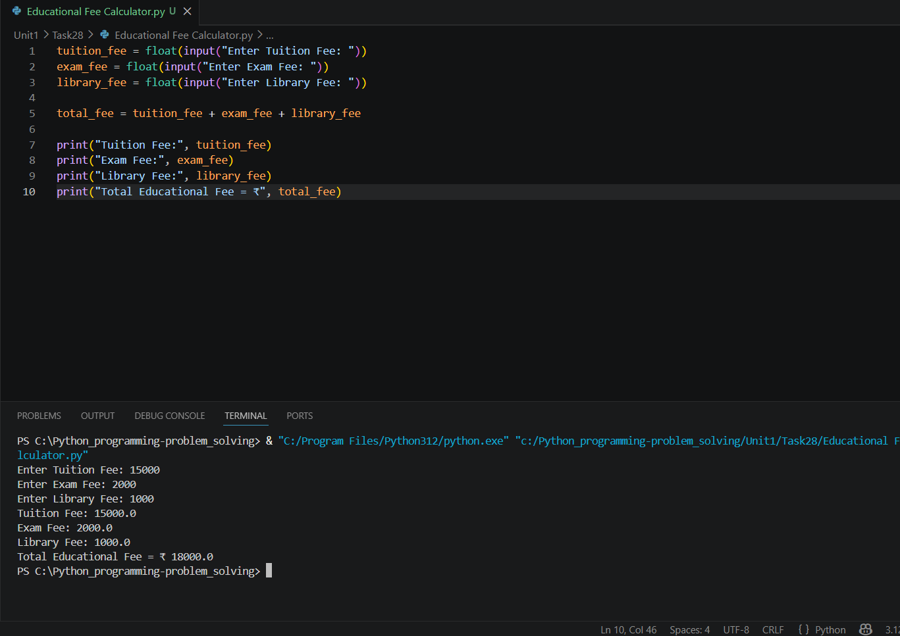

# GST Billing System

## 1. Problem Statement

Write a Python program to calculate GST amount and generate the final bill.

The program should accept product amount and GST percentage from the user and display the GST amount and final bill.

---

## 2. Algorithm

1. Start

2. Input product amount

3. Input GST percentage

4. Calculate GST amount:

   * GST Amount = (Product Amount × GST Percentage) / 100

5. Calculate final bill:

   * Final Bill = Product Amount + GST Amount

6. Display GST amount and final bill

7. Stop

---

## 3. Flowchart



---

## 4. Python Source Code

```python
amount = float(input("Enter Product Amount: "))
gst_percent = float(input("Enter GST Percentage: "))

gst_amount = (amount * gst_percent) / 100
final_bill = amount + gst_amount

print("Product Amount:", amount)
print("GST Amount:", gst_amount)
print("Final Bill Amount = ₹", final_bill)
```

---

## 5. Sample Input / Output

### Sample 1:

Input:

```text
Enter Product Amount: 1000
Enter GST Percentage: 18
```

Output:

```text
Product Amount: 1000.0
GST Amount: 180.0
Final Bill Amount = ₹ 1180.0
```

### Sample 2:

Input:

```text
Enter Product Amount: 2500
Enter GST Percentage: 12
```

Output:

```text
Product Amount: 2500.0
GST Amount: 300.0
Final Bill Amount = ₹ 2800.0
```

---

## 6. Screenshots



---